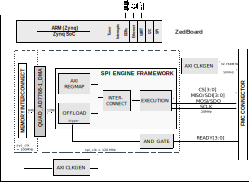

.. _quad_adaq77681:

QUAD_ADAQ77681 HDL project
=================================================================================

Overview
---------------------------------------------------------------------------------

The :adi:`ADAQ7768-1` is a 24-bit precision data acquisition (DAQ) μModule system
that encapsulates signal conditioning, conversion, and processing blocks into one
system-in-package (SiP) design for the rapid development of highly compact,
high-performance precision DAQ systems.

The :adi:`ADAQ7768-1` consists of a low-noise, low-bias current, high-bandwidth
programmable gain instrumentation amplifier (PGIA) also capable of signal
amplification and signal attenuation while maintaining high input impedance, a
fourth-order, low-noise, linear phase anti-aliasing filter, a low-noise,
low-distortion, high-bandwidth ADC driver plus an optional linearity boost
buffer. Also, contains a high-performance medium bandwidth 24-bit Σ-Δ ADC with
programmable digital filter,a low-noise, low-dropout linear regulator, reference
buffers and critical passive components required for the signal chain.

The :adi:`ADAQ7768-1` supports fully differential input signal with a maximum
range of ±12.6 V. It has an input common-mode voltage range of ±12 V with
excellent common-mode rejection ratio (CMRR). The input signal is fully buffered
with very low input bias current of 2 pA typical. This allows easy input
impedance matching and enables the :adi:`ADAQ7768-1` to directly interface to
sensors with high output impedance.

The analog-to-digital converter (ADC) inside the :adi:`ADAQ7768-1` is a
high-performance, 24-bit precision, single-channel sigma-delta converter with
excellent AC performance and DC precision, and the throughput rate of 256 kSPS
from a 16.384 MHz MCLK.

The :adi:`ADAQ7768-1` device has an operating temperature range of −40°C to +85°C
and is available in a 12.00 mm × 6.00 mm 84-ball CSP_BGA package with an 0.80 mm
ball pitch, which makes it ideal for multiple channel applications.

Supported boards
-------------------------------------------------------------------------------

-  QUAD_AD77681 PMB0004 EvalPlus Signal Chain Board

Supported devices
-------------------------------------------------------------------------------

-  :adi:`ADAQ7768-1`

Supported carriers
-------------------------------------------------------------------------------

-  :xilinx:`ZedBoard <products/boards-and-kits/1-8dyf-11.html>` on FMC slot

Block design
-------------------------------------------------------------------------------

Block diagram
~~~~~~~~~~~~~~~~~~~~~~~~~~~~~~~~~~~~~~~~~~~~~~~~~~~~~~~~~~~~~~~~~~~~~~~~~~~~~~~

The data path and clock domains are depicted in the below diagram:

QUAD_ADAQ77681
^^^^^^^^^^^^^^^^^^^^^^^^^^^^^^^^^^^^^^^^^^^^^^^^^^^^^^^^^^^^^^^^^^^^^^^^^^^^^^^

CPU/Memory interconnects addresses
~~~~~~~~~~~~~~~~~~~~~~~~~~~~~~~~~~~~~~~~~~~~~~~~~~~~~~~~~~~~~~~~~~~~~~~~~~~~~~~

The addresses are dependent on the architecture of the FPGA, having an offset
added to the base address from HDL (see more at :ref:`architecture`).

=========================  ===============
Instance                   Zynq
=========================  ===============
quad_adaq77681_axi_regmap  0x44A0_0000
axi_qadc_dma               0x44A3_0000
spi_clkgen                 0x44A7_0000
mclk_clkgen                0x44B0_0000
=========================  ===============

I2C connections
~~~~~~~~~~~~~~~~~~~~~~~~~~~~~~~~~~~~~~~~~~~~~~~~~~~~~~~~~~~~~~~~~~~~~~~~~~~~~~~

.. list-table::
   :widths: 20 20 20 20 20
   :header-rows: 1

   * - I2C type
     - I2C manager instance
     - Alias
     - Address
     - I2C subordinate
   * - PL
     - iic_fmc
     - axi_iic_fmc
     - 0x4162_0000
     - ---
   * - PL
     - iic_main
     - axi_iic_main
     - 0x4160_0000
     - ---

SPI connections
~~~~~~~~~~~~~~~~~~~~~~~~~~~~~~~~~~~~~~~~~~~~~~~~~~~~~~~~~~~~~~~~~~~~~~~~~~~~~~~

.. list-table::
   :widths: 25 25 25 25
   :header-rows: 1

   * - SPI type
     - SPI manager instance
     - SPI subordinate
     - CS
   * - PL
     - axi_spi_engine
     - quad_adaq77681
     - 0

GPIOs
~~~~~~~~~~~~~~~~~~~~~~~~~~~~~~~~~~~~~~~~~~~~~~~~~~~~~~~~~~~~~~~~~~~~~~~~~~~~~~~

The Software GPIO number is calculated as follows:

-  Zynq-7000: if PS7 is used, then offset is 54

.. list-table::
   :widths: 25 25 25 25
   :header-rows: 2

   * - GPIO signal
     - Direction
     - HDL GPIO EMIO
     - Software GPIO
   * -
     - (from FPGA view)
     -
     - Zynq-7000
   * - qadc_pgood[3:0]
     - INOUT
     - 44:41
     - 98:95
   * - qadc_muxa[1:0]
     - INOUT
     - 40:39
     - 94:93
   * - qadc_muxb[1:0]
     - INOUT
     - 38:37
     - 92:91
   * - qadc_muxc[1:0]
     - INOUT
     - 36:35
     - 90:89
   * - qadc_muxd[1:0]
     - INOUT
     - 34:33
     - 88:87
   * - qadc_sync
     - INOUT
     - 32
     - 86

Interrupts
~~~~~~~~~~~~~~~~~~~~~~~~~~~~~~~~~~~~~~~~~~~~~~~~~~~~~~~~~~~~~~~~~~~~~~~~~~~~~~~

Below are the Programmable Logic interrupts used in this project.

=================== === ========== ===========
Instance name       HDL Linux Zynq Actual Zynq
=================== === ========== ===========
axi_qadc_dma        13  57         89
quad_adaq77681      12  56         88
=================== === ========== ===========

Building the HDL project
-------------------------------------------------------------------------------

The design is built upon ADI's generic HDL reference design framework.
ADI distributes the bit/elf files of these projects as part of the
:dokuwiki:`ADI Kuiper Linux <resources/tools-software/linux-software/kuiper-linux>`.
If you want to build the sources, ADI makes them available on the
:git-hdl:`HDL repository </>`. To get the source you must
`clone <https://git-scm.com/book/en/v2/Git-Basics-Getting-a-Git-Repository>`__
the HDL repository, and then build the project as follows:

**Linux/Cygwin/WSL**

.. code-block::
   :linenos:

   user@analog:~$ cd hdl/projects/quad_adaq77681/zed
   user@analog:~/hdl/projects/quad_adaq77681/zed$ make

A more comprehensive build guide can be found in the :ref:`build_hdl` user guide.

Hardware related
~~~~~~~~~~~~~~~~~~~~~~~~~~~~~~~~~~~~~~~~~~~~~~~~~~~~~~~~~~~~~~~~~~~~~~~~~~~~~~~

-  Product datasheets:

   -  :adi:`ADAQ7768-1`

HDL related
~~~~~~~~~~~~~~~~~~~~~~~~~~~~~~~~~~~~~~~~~~~~~~~~~~~~~~~~~~~~~~~~~~~~~~~~~~~~~~~

-  :git-hdl:`quad_adaq77681 HDL project source code <projects/quad_adaq77681>`

.. list-table::
   :widths: 30 40 30
   :header-rows: 1

   * - IP name
     - Source code link
     - Documentation link
   * - AXI_CLKGEN
     - :git-hdl:`library/axi_clkgen <library/axi_clkgen>`
     - :ref:`here <axi_clkgen>`
   * - AXI_DMAC
     - :git-hdl:`library/axi_dmac <library/axi_dmac>`
     - :ref:`here <axi_dmac>`
   * - AXI_HDMI_TX
     - :git-hdl:`library/axi_hdmi_tx <library/axi_hdmi_tx>`
     - :ref:`here <axi_hdmi_tx>`
   * - AXI_I2S_ADI
     - :git-hdl:`library/axi_i2s_adi <library/axi_i2s_adi>`
     - ---
   * - AXI_SPDIF_TX
     - :git-hdl:`library/axi_spdif_tx <library/axi_spdif_tx>`
     - ---
   * - AXI_SYSID
     - :git-hdl:`library/axi_sysid <library/axi_sysid>`
     - :ref:`here <axi_sysid>`
   * - AXI_SPI_ENGINE
     - :git-hdl:`library/spi_engine/axi_spi_engine <library/spi_engine/axi_spi_engine>`
     - :ref:`here <spi_engine axi>`
   * - SPI_ENGINE_EXECUTION
     - :git-hdl:`library/spi_engine/spi_engine_execution <library/spi_engine/spi_engine_execution>`
     - :ref:`here <spi_engine execution>`
   * - SPI_ENGINE_INTERCONNECT
     - :git-hdl:`library/spi_engine/spi_engine_interconnect <library/spi_engine/spi_engine_interconnect>`
     - :ref:`here <spi_engine interconnect>`
   * - SPI_ENGINE_OFFLOAD
     - :git-hdl:`library/spi_engine/spi_engine_offload`
     - :ref:`here <spi_engine offload>`
   * - SYSID_ROM
     - :git-hdl:`library/sysid_rom <library/sysid_rom>`
     - :ref:`here <axi_sysid>`
   * - UTIL_I2C_MIXER
     - :git-hdl:`library/util_i2c_mixer <library/util_i2c_mixer>`
     - ---

-  :ref:`SPI Engine Framework documentation <spi_engine>`

Software related
~~~~~~~~~~~~~~~~~~~~~~~~~~~~~~~~~~~~~~~~~~~~~~~~~~~~~~~~~~~~~~~~~~~~~~~~~~~~~~~

- :git-linux:`QUAD_ADAQ7768-1 Linux driver source code <drivers/iio/adc/ad7768-1.c>`
-  ADAQ7768-1 Linux device tree :git-linux:`zynq-zed-adv7511-quad-adaq7768-1-evb.dts <arch/arm/boot/dts/zynq-zed-adv7511-quad-adaq7768-1-evb.dts>`

.. include:: ../common/more_information.rst

.. include:: ../common/support.rst
