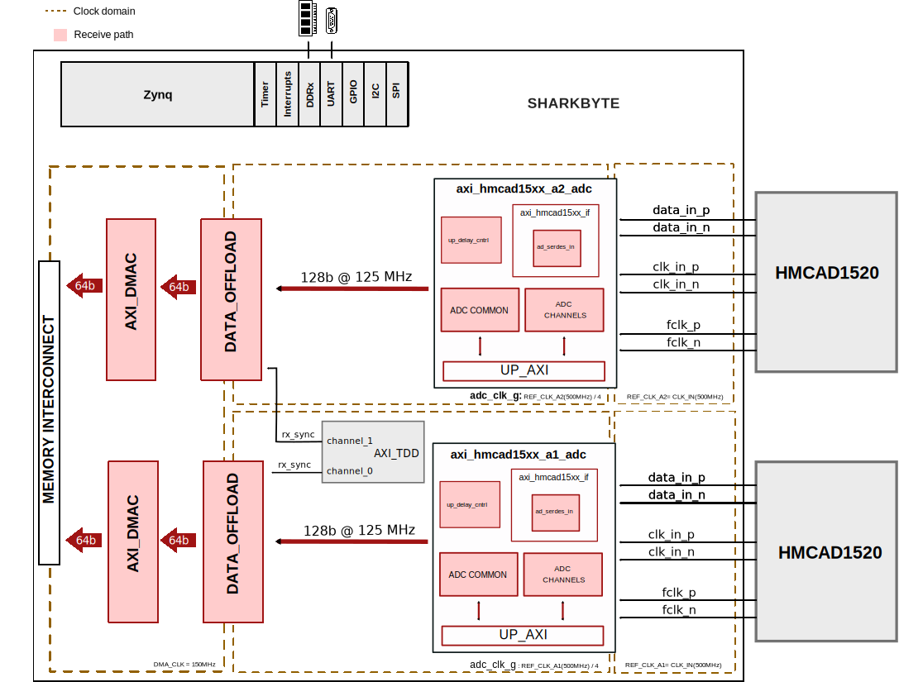
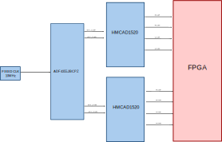

.. _sharkbyte:

Sharkbyte HDL Project
===============================================================================

Overview
-------------------------------------------------------------------------------

The Sharkbyte is a dual-channel HMCAD15xx ADC data acquisition system targeting
Xilinx Zynq-7000. It supports synchronous capture from both ADCs in all
supported resolutions (8/12/14-bit) for up to 64KB of data per channel.

The design uses the TDD IP to generate a sync signal that triggers simultaneous
capture start on both ADC channels, ensuring sample-aligned data acquisition.

Key features:

- 1 GSPS sampling rate (1 ns time resolution) / 8-bit vertical resolution
- 2 differential input channels
- 50-ohm input impedance
- 0°C to 85°C(ambient)
- Configurable input range (0.5V to 1.5V default, configurable to -4V min to
  +4V max)
- Built-in non-volatile storage
- Programmable trigger functionality
- SPI, I2C, USB interfaces for control and data offloading

Supported boards
-------------------------------------------------------------------------------

- Sharkbyte

Supported devices
-------------------------------------------------------------------------------

- :adi:`HMCAD1511` (12-bit, 1-channel)
- :adi:`HMCAD1520` (14-bit, 4-channel)
- :adi:`ADF4355` (PLL/clock generator)
- :adi:`ADP5589` (GPIO expander)
- :adi:`AD5696` (DAC)

Block design
-------------------------------------------------------------------------------

The design implements a dual ADC capture system with BRAM-based data offload
for synchronized acquisition. Each ADC channel has its own data path consisting
of an LVDS interface, BRAM buffer, and DMA engine.

Block diagram
~~~~~~~~~~~~~~~~~~~~~~~~~~~~~~~~~~~~~~~~~~~~~~~~~~~~~~~~~~~~~~~~~~~~~~~~~~~~~~~

The data path and clock domains are depicted in the below diagram:

Clock scheme
~~~~~~~~~~~~~~~~~~~~~~~~~~~~~~~~~~~~~~~~~~~~~~~~~~~~~~~~~~~~~~~~~~~~~~~~~~~~~~~

The design uses the following clock domains(all the rates are described at the
highest sampling rate of 1 GSPS):

.. list-table::
   :widths: 20 20 60
   :header-rows: 1

   * - Clock
     - Frequency
     - Description
   * - FCLK_CLK0
     - 100 MHz
     - CPU clock, AXI register access
   * - FCLK_CLK1
     - 200 MHz
     - IODELAY reference clock
   * - FCLK_CLK2
     - 150 MHz
     - DMA clock DATA offloadoutput
   * - ref_clk_a1/a2
     - 500 MHz
     - ADC LVDS input clock (from ADF4355)
   * - adc_clk/adc_clk_1
     - 125 MHz
     - Divided ADC clock (ref_clk/4)

The ADF4355 PLL provides the 1GHz reference clock to both ADCs which then is
sent to the FPGA as the 500MHz reference clock(ref_clk_a1/a2).
The LVDS interface deserializes the DDR data and divides the clock by 4 to
produce the 125 MHz sample clock.

Configuration modes
~~~~~~~~~~~~~~~~~~~~~~~~~~~~~~~~~~~~~~~~~~~~~~~~~~~~~~~~~~~~~~~~~~~~~~~~~~~~~~~

The design supports the following ADC operating modes controlled via SPI:

- **8-bit mode**: 1 GSPS, single channel
- **12-bit mode**: 500 MSPS, single channel (HMCAD1511)
- **dual 8-bit mode (14-bit resolution)**: 125 MSPS, 4 channels interleaved
  (HMCAD1520)

The ``axi_hmcad15xx`` IP parameters:

.. list-table::
   :widths: 30 70
   :header-rows: 1

   * - Parameter
     - Description
   * - NUM_CHANNELS
     - Number of ADC channels (1-4)
   * - IODELAY_CTRL
     - Set to 1 for one instance only (shared IDELAYCTRL)

CPU/Memory interconnects addresses
~~~~~~~~~~~~~~~~~~~~~~~~~~~~~~~~~~~~~~~~~~~~~~~~~~~~~~~~~~~~~~~~~~~~~~~~~~~~~~~

The addresses are dependent on the architecture of the FPGA, having an offset
added to the base address from HDL (see more at :ref:`architecture cpu-intercon-addr`).

==================== ===========
Instance             Zynq
==================== ===========
axi_iic_main         0x4160_0000
axi_hmcad15xx_a1_adc 0x44A0_0000
hmcad15xx_a1_dma     0x44A3_0000
axi_hmcad15xx_a2_adc 0x44A6_0000
hmcad15xx_a2_dma     0x44A9_0000
axi_tdd_sync         0x44AC_0000
adc1_data_offload    0x44B0_0000
adc2_data_offload    0x44B1_0000
==================== ===========

I2C connections
~~~~~~~~~~~~~~~~~~~~~~~~~~~~~~~~~~~~~~~~~~~~~~~~~~~~~~~~~~~~~~~~~~~~~~~~~~~~~~~

.. list-table::
   :widths: 20 20 20 20 20
   :header-rows: 1

   * - I2C type
     - I2C manager instance
     - Alias
     - Address
     - I2C subordinate
   * - PL
     - axi_iic_main
     - ---
     - 0x34
     - ADP5589 (GPIO expander)
   * - PL
     - axi_iic_main
     - ---
     - 0x0C
     - AD5696 (DAC)
   * - PL
     - axi_iic_main
     - ---
     - 0x5F
     - MAX31827 (temperature sensor)

SPI connections
~~~~~~~~~~~~~~~~~~~~~~~~~~~~~~~~~~~~~~~~~~~~~~~~~~~~~~~~~~~~~~~~~~~~~~~~~~~~~~~

.. list-table::
   :widths: 25 25 25 25
   :header-rows: 1

   * - SPI type
     - SPI manager instance
     - SPI subordinate
     - CS
   * - PS
     - SPI 0
     - HMCAD15xx (ADC1)
     - 0
   * - PS
     - SPI 0
     - HMCAD15xx (ADC2)
     - 1
   * - PS
     - SPI 0
     - ADF4355 (PLL)
     - 2

GPIOs
~~~~~~~~~~~~~~~~~~~~~~~~~~~~~~~~~~~~~~~~~~~~~~~~~~~~~~~~~~~~~~~~~~~~~~~~~~~~~~~

.. list-table::
   :widths: 25 25 25 25
   :header-rows: 2

   * - GPIO signal
     - Direction
     - HDL GPIO EMIO
     - Software GPIO
   * -
     - (from FPGA view)
     -
     - Zynq-7000
   * - ad9696_ldac
     - INOUT
     - 0
     - 54

Interrupts
~~~~~~~~~~~~~~~~~~~~~~~~~~~~~~~~~~~~~~~~~~~~~~~~~~~~~~~~~~~~~~~~~~~~~~~~~~~~~~~

Below are the Programmable Logic interrupts used in this project.

=================== === ========== ===========
Instance name       HDL Linux Zynq Actual Zynq
=================== === ========== ===========
axi_iic_main        15  59         91
hmcad15xx_a2_dma    13  57         89
hmcad15xx_a1_dma    12  56         88
=================== === ========== ===========

Building the HDL project
-------------------------------------------------------------------------------

The design is built upon ADI's generic HDL reference design framework.
ADI distributes the bit/elf files of these projects as part of the
:dokuwiki:`ADI Kuiper Linux <resources/tools-software/linux-software/kuiper-linux>`.
If you want to build the sources, ADI makes them available on the
:git-hdl:`HDL repository </>`. To get the source you must
`clone <https://git-scm.com/book/en/v2/Git-Basics-Getting-a-Git-Repository>`__
the HDL repository.

Go to the hdl/projects/**sharkbyte** location and run the make command.

**Linux/Cygwin/WSL**

.. shell::

   $cd hdl/projects/sharkbyte
   $make

A more comprehensive build guide can be found in the :ref:`build_hdl` user
guide.

Resources
-------------------------------------------------------------------------------

Hardware related
~~~~~~~~~~~~~~~~~~~~~~~~~~~~~~~~~~~~~~~~~~~~~~~~~~~~~~~~~~~~~~~~~~~~~~~~~~~~~~~

- Product datasheets:

  - :adi:`HMCAD1520`
  - :adi:`ADF4355`

HDL related
~~~~~~~~~~~~~~~~~~~~~~~~~~~~~~~~~~~~~~~~~~~~~~~~~~~~~~~~~~~~~~~~~~~~~~~~~~~~~~~

- :git-hdl:`Sharkbyte HDL project source code <projects/sharkbyte>`

.. list-table::
   :widths: 30 35 35
   :header-rows: 1

   * - IP name
     - Source code link
     - Documentation link
   * - AXI_HMCAD15XX
     - :git-hdl:`library/axi_hmcad15xx`
     - :ref:`axi_hmcad15xx`
   * - AXI_DMAC
     - :git-hdl:`library/axi_dmac`
     - :ref:`axi_dmac`
   * - AXI_TDD
     - :git-hdl:`library/axi_tdd`
     - :ref:`axi_tdd`
   * - DATA_OFFLOAD
     - :git-hdl:`library/data_offload`
     - :ref:`data_offload`
   * - UTIL_DO_RAM
     - :git-hdl:`library/util_do_ram`
     - ---

Software related
~~~~~~~~~~~~~~~~~~~~~~~~~~~~~~~~~~~~~~~~~~~~~~~~~~~~~~~~~~~~~~~~~~~~~~~~~~~~~~~

- :git-linux:`Sharkbyte device tree (14-bit) <arch/arm/boot/dts/xilinx/zynq-sharkbyte_14b.dts>`
- :git-linux:`Sharkbyte device tree (12-bit) <arch/arm/boot/dts/xilinx/zynq-sharkbyte_12b.dts>`
- :git-linux:`Sharkbyte device tree (8-bit) <arch/arm/boot/dts/xilinx/zynq-sharkbyte.dts>`
- :git-linux:`HMCAD15XX Linux driver <drivers/iio/adc/hmcad15xx.c>`

.. include:: ../common/more_information.rst

.. include:: ../common/support.rst
