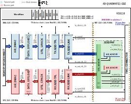

:orphan:

.. _template_project:

AD---- HDL Project (template)
===============================================================================

Overview
-------------------------------------------------------------------------------

..
   Some specifications about the board, the chip, etc. Typically the
   information found on the https://www.analog.com/en/products/
   website

Supported boards
-------------------------------------------------------------------------------

- :adi:`EVAL-AD9467`

Supported devices
-------------------------------------------------------------------------------

..
   EXAMPLES

- :adi:`AD9467`
- :adi:`AD9081`
- :adi:`AD9177`
- :adi:`AD9209`

Supported carriers
-------------------------------------------------------------------------------

..
   At least one. Should be updated each time the project is ported to
   another carrier.

   Take these tables as an example:

.. list-table::
   :widths: 35 35 30
   :header-rows: 1

   * - Evaluation board
     - Carrier
     - FMC slot
   * - :adi:`EVAL-AD9081`
     - :intel:`A10SoC <content/www/us/en/products/details/fpga/arria/10/sx/products.html>`
     - FMCA
   * -
     - :xilinx:`VCK190`
     - FMC0
   * -
     - :xilinx:`VCU118`
     - FMC+
   * -
     - :xilinx:`ZCU102`
     - FMC HPC0
   * -
     - :xilinx:`ZC706`
     - FMC HPC

Block design
-------------------------------------------------------------------------------

Block diagram
~~~~~~~~~~~~~~~~~~~~~~~~~~~~~~~~~~~~~~~~~~~~~~~~~~~~~~~~~~~~~~~~~~~~~~~~~~~~~~~

..
  If the project has multiple ways of configuration, then make subsections to
  this section and show the default configuration and some other popular modes.

..
   KEEP THIS PARAGRAPH

The data path and clock domains are depicted in the below diagram:

.. important::

   This configuration was built using the ``make`` command with the following
   parameters:

   .. shell:: bash

      /hdl/projects/ad_quadmxfe1_ebz
      $make JESD_MODE=8B10B \
      $     RX_JESD_L=4 \
      $     RX_JESD_M=8 \
      $     RX_JESD_NP=16 \
      $     RX_NUM_LINKS=4 \
      $     TX_JESD_L=4 \
      $     TX_JESD_M=8 \
      $     TX_JESD_NP=16 \
      $     TX_NUM_LINKS=4

.. collapsible:: Click here for details on the block diagram modules

   .. list-table::
      :widths: 10 20 35 35
      :header-rows: 1

      * - Block name
        - IP name
        - Documentation
        - Additional info
      * - AXI_ADXCVR
        - :git-hdl:`axi_adxcvr <library/xilinx/axi_adxcvr>`
        - :ref:`axi_adxcvr`
        - 2 instances, one for RX and one for TX
      * - AXI_DMAC
        - :git-hdl:`axi_dmac <library/axi_dmac>`
        - :ref:`axi_dmac`
        - 2 instances, one for RX and one for TX
      * - DATA_OFFLOAD
        - :git-hdl:`data_offload <library/data_offload>`
        - :ref:`data_offload`
        - 2 instances, one for RX and one for TX
      * - RX JESD LINK
        - axi_mxfe_rx_jesd
        - :ref:`axi_jesd204_rx`
        - Instantiaded by ``adi_axi_jesd204_rx_create`` procedure
      * - RX JESD TPL
        - rx_mxfe_tpl_core
        - :ref:`ad_ip_jesd204_tpl_adc`
        - Instantiated by ``adi_tpl_jesd204_rx_create`` procedure
      * - TX JESD LINK
        - axi_mxfe_tx_jesd
        - :ref:`axi_jesd204_tx`
        - Instantiaded by ``adi_axi_jesd204_tx_create`` procedure
      * - TX JESD TPL
        - tx_mxfe_tpl_core
        - :ref:`ad_ip_jesd204_tpl_dac`
        - Instantiated by ``adi_tpl_jesd204_tx_create`` procedure
      * - UTIL_ADXCVR
        - :git-hdl:`util_adxcvr <library/xilinx/util_adxcvr>`
        - :ref:`util_adxcvr`
        - Used for both AXI ADXCVR instances
      * - UTIL_CPACK
        - :git-hdl:`util_cpack2 <library/util_pack/util_cpack2>`
        - :ref:`util_cpack2`
        - ---
      * - UTIL_UPACK
        - :git-hdl:`util_upack2 <library/util_pack/util_upack2>`
        - :ref:`util_upack2`
        - ---
..
   MUST: Use SVG format for the diagram

..
   TIP: Block diagrams should contain subtitles only if there are at least two
   different diagrams

Clock scheme
~~~~~~~~~~~~~~~~~~~~~~~~~~~~~~~~~~~~~~~~~~~~~~~~~~~~~~~~~~~~~~~~~~~~~~~~~~~~~~~

- External clock source
  :dokuwiki:`AD-SYNCHRONA14-EBZ <resources/eval/user-guides/ad-synchrona14-ebz>`
- SYSREF clocks are LVDS
- ADCCLK and REFCLK are LVPECL

..
   ADD IMAGE IF APPLIES! MUST: Use SVG format

..
   DESCRIBE OTHER COMPONENTS FROM THE PROJECT, EX: SYNCHRONA

Only the channels presented in the clocking selection are relevant. For
the rest, you can either disable them or just put a divided frequency of
the source clock.

Limitations
^^^^^^^^^^^^^^^^^^^^^^^^^^^^^^^^^^^^^^^^^^^^^^^^^^^^^^^^^^^^^^^^^^^^^^^^^^^^^^^

..
   EXAMPLE OF CONFIGURATION/LIMITATION. PLEASE WRITE THIS KIND OF INFORMATION IF
   IT APPLIES TO THE PROJECT

The design has one JESD receive chain with 4 lanes at rate of 13Gbps.
The JESD receive chain consists of a physical layer represented by an
XCVR module, a link layer represented by an RX JESD LINK module and
transport layer represented by a RX JESD TPL module. The link operates
in Subclass 1.

The link is set for full bandwidth mode and operate with the following
parameters:

Deframer paramaters: L=4, M=2, F=1, S=1, NP=16

| SYSREF - 5.078125 MHZ
| REFCLK - 325MHz (Lane Rate/40)
| DEVICECLK - 325 MHz
| ADCCLK - 1300MHz
| JESD204B Lane Rate - 13Gbps

The transport layer component presents on its output 128 bits at once on
every clock cycle, representing 4 samples per converter. The two receive
chains are merged together and transferred to the DDR with a single DMA.

Configuration modes
~~~~~~~~~~~~~~~~~~~~~~~~~~~~~~~~~~~~~~~~~~~~~~~~~~~~~~~~~~~~~~~~~~~~~~~~~~~~~~~

..
   MENTION IF ANY MODES ARE AVAILABLE FOR CONFIGURATION

..
   EXAMPLES BUT NOT LIMITED TO

The following are the parameters of this project that can be configured:

- JESD_MODE: used link layer encoder mode

  - 64B66B - 64b66b link layer defined in JESD204C, uses AMD IP as Physical Layer
  - 8B10B - 8b10b link layer defined in JESD204B, uses ADI IP as Physical Layer

- RX_LANE_RATE: lane rate of the Rx link (MxFE to FPGA)
- TX_LANE_RATE: lane rate of the Tx link (FPGA to MxFE)
- REF_CLK_RATE: the rate of the reference clock
- [RX/TX]_JESD_M: number of converters per link
- [RX/TX]_JESD_L: number of lanes per link
- [RX/TX]_JESD_S: number of samples per frame
- [RX/TX]_JESD_NP: number of bits per sample
- [RX/TX]_NUM_LINKS: number of links
- [RX/TX]_TPL_WIDTH
- TDD_SUPPORT: set to 1, adds the TDD; enables external synchronization through TDD. Must be set to 1 when SHARED_DEVCLK=1
- SHARED_DEVCLK
- TDD_CHANNEL_CNT
- TDD_SYNC_WIDTH
- TDD_SYNC_INT
- TDD_SYNC_EXT
- TDD_SYNC_EXT_CDC: if enabled, the CDC circuitry for the external sync signal is added
- [RX/TX]_KS_PER_CHANNEL: Number of samples stored in internal buffers in
  kilosamples per converter (M)
- [ADC/DAC]_DO_MEM_TYPE
- Check out this guide on more details regarding these parameters:
  :ref:`axi_tdd`

Detailed description
~~~~~~~~~~~~~~~~~~~~~~~~~~~~~~~~~~~~~~~~~~~~~~~~~~~~~~~~~~~~~~~~~~~~~~~~~~~~~~~

..
  Give details about how many JESD chains/how many lanes

The design has one JESD204B receive chain and one transmit chain, each with
8 lanes.

Each chain consists of a transport layer represented by a JESD TPL module,
a link layer represented by a JESD LINK module, and a shared among chains
physical layer, represented by an XCVR module. The HDL project in its current
state, has **the link operating in subclass 0**.

..
  Specify the clock frequencies from the system

- Rx device clock - 122.88 MHz
- Tx device clock - 245.76 MHz
- JESD204B Rx Lane Rate - 4.9152 Gbps
- JESD204B Tx Lane Rate - 9.8304 Gbps

..
  GIVE DETAILS ABOUT THE JESD LAYERS/IMPORTANT MODULES, IN COLLAPSIBLE
  SECTIONS IF THERE IS TOO MUCH INFORMATION!
  TAKE A LOOK AT FMCOMMS11 EXAMPLE.

.. collapsible:: JESD204 Physical layer

   ..
    Notable information about the physical layer.

.. collapsible:: JESD204 Link layer

   ..
    Notable information about the link layer.

.. collapsible:: JESD204 Transport layer

   ..
    Notable information about the transport layer.

.. collapsible:: Top file

   ..
    Notable information about the top file.

CPU/Memory interconnects addresses
~~~~~~~~~~~~~~~~~~~~~~~~~~~~~~~~~~~~~~~~~~~~~~~~~~~~~~~~~~~~~~~~~~~~~~~~~~~~~~~

..
   KEEP THIS PARAGRAPH

The addresses are dependent on the architecture of the FPGA, having an offset
added to the base address from HDL (see more at :ref:`architecture cpu-intercon-addr`).

..
   If there are any PL SPI connections, they must be added in this table too

..
   THIS IS JUST AN EXAMPLE

Depending on the values of parameters $INTF_CFG, $ADI_PHY_SEL and $TDD_SUPPORT,
some IPs are instantiated and some are not.

Check-out the table below to find out the conditions.

..
   MUST: Hexadecimal addresses are written in caps and separated by an underscore.

==================== ================================= =============== =========== ============
Instance             Depends on parameter              Zynq/Microblaze ZynqMP      Versal
==================== ================================= =============== =========== ============
axi_mxfe_rx_xcvr     $INTF_CFG!="TX" & $ADI_PHY_SEL==1 0x44A6_0000     0x84A6_0000 0xA4A6_00000
rx_mxfe_tpl_core     $INTF_CFG!="TX"                   0x44A1_0000     0x84A1_0000 0xA4A1_00000
axi_mxfe_rx_jesd     $INTF_CFG!="TX"                   0x44A9_0000     0x84A9_0000 0xA4A9_00000
axi_mxfe_rx_dma      $INTF_CFG!="TX"                   0x7C42_0000     0x9C42_0000 0xBC42_00000
mxfe_rx_data_offload $INTF_CFG!="TX"                   0x7C45_0000     0x9C45_0000 0xBC45_00000
axi_mxfe_tx_xcvr     $INTF_CFG!="RX" & $ADI_PHY_SEL==1 0x44B6_0000     0x84B6_0000 0xA4B6_00000
tx_mxfe_tpl_core     $INTF_CFG!="RX"                   0x44B1_0000     0x84B1_0000 0xA4B1_00000
axi_mxfe_tx_jesd     $INTF_CFG!="RX"                   0x44B9_0000     0x84B9_0000 0xA4B9_00000
axi_mxfe_tx_dma      $INTF_CFG!="RX"                   0x7C43_0000     0x9C43_0000 0xBC43_00000
mxfe_tx_data_offload $INTF_CFG!="RX"                   0x7C44_0000     0x9C44_0000 0xBC44_00000
axi_tdd_0            $TDD_SUPPORT==1                   0x7C46_0000     0x9C46_0000 0xBC46_00000
==================== ================================= =============== =========== ============

I2C connections
~~~~~~~~~~~~~~~~~~~~~~~~~~~~~~~~~~~~~~~~~~~~~~~~~~~~~~~~~~~~~~~~~~~~~~~~~~~~~~~

.. list-table::
   :widths: 20 20 20 20 20
   :header-rows: 1

   * - I2C type
     - I2C manager instance
     - Alias
     - Address
     - I2C subordinate
   * -
     -
     -
     -
     -

SPI connections
~~~~~~~~~~~~~~~~~~~~~~~~~~~~~~~~~~~~~~~~~~~~~~~~~~~~~~~~~~~~~~~~~~~~~~~~~~~~~~~

..
   THESE ARE JUST EXAMPLES!

.. list-table::
   :widths: 25 25 25 25
   :header-rows: 1

   * - SPI type
     - SPI manager instance
     - SPI subordinate
     - CS
   * - PS
     - SPI 0
     - ADXYZT
     - 0
   * - PS
     - SPI 1
     - AD0000
     - 0
   * - PL
     - axi_spi_bus_1
     - AD23456
     - 0

GPIOs
~~~~~~~~~~~~~~~~~~~~~~~~~~~~~~~~~~~~~~~~~~~~~~~~~~~~~~~~~~~~~~~~~~~~~~~~~~~~~~~

..
   Add explanation depending on your case

.. list-table::
   :widths: 25 20 20 20 15
   :header-rows: 2

   * - GPIO signal
     - Direction
     - HDL GPIO EMIO
     - Software GPIO
     - Software GPIO
   * -
     - (from FPGA view)
     -
     - Zynq-7000
     - Zynq MP
   * - signal_name[31:0]
     - IN/OUT/INOUT
     - 127:96
     - 181:150
     - 205:174
   * - signal_name[31:0]
     - IN/OUT/INOUT
     - 95:64
     - 149:118
     - 173:142
   * - signal_name[31:0]
     - IN/OUT/INOUT
     - 63:32
     - 117:86
     - 141:110

..
   MUST: GPIOs should be listed in descending order and should have the number
   of bits specified next to their name

Interrupts
~~~~~~~~~~~~~~~~~~~~~~~~~~~~~~~~~~~~~~~~~~~~~~~~~~~~~~~~~~~~~~~~~~~~~~~~~~~~~~~

Below are the Programmable Logic interrupts used in this project.

You have many ways of writing this table: as a list-table or really to draw
it. Take a look in the .rst of this page to see how they're written and
which suits best your case.

================ === ========== =========== ============ ============= ====== =============== ================
Instance name    HDL Linux Zynq Actual Zynq Linux ZynqMP Actual ZynqMP S10SoC Linux Cyclone V Actual Cyclone V
================ === ========== =========== ============ ============= ====== =============== ================
---              15  59         91          111          143           32     55              87
---              14  58         90          110          142           31     54              86
---              13  57         89          109          141           30     53              85
---              12  56         88          108          140           29     52              84
---              11  55         87          107          139           28     51              83
---              10  54         86          106          138           27     50              82
---              9   53         85          105          137           26     49              81
---              8   52         84          104          136           25     48              80
---              7   36         68          96           128           24     47              79
---              6   35         67          95           127           23     46              78
---              5   34         66          94           126           22     45              77
---              4   33         65          93           125           21     44              76
---              3   32         64          92           124           20     43              75
---              2   31         63          91           123           19     42              74
---              1   30         62          90           122           18     41              73
---              0   29         61          89           121           17     40              72
================ === ========== =========== ============ ============= ====== =============== ================

..
   These are the project-specific interrupts (usually found in
   /project_name/common/Project_name_bd,tcl).
   Add the name of the component that uses that interrupt.
   Delete the dropdown section when you insert the table in your page

..
   NOTE THAT FOR ULTRASCALE\+ DEVICES, THE PS I2C IS NOT SUPPORTED IN LINUX!!
   ALWAYS USE PL I2C FOR THESE DESIGNS!!

Resource utilization
~~~~~~~~~~~~~~~~~~~~~~~~~~~~~~~~~~~~~~~~~~~~~~~~~~~~~~~~~~~~~~~~~~~~~~~~~~~~~~~
..
  To see the resources utilization, please go to
  :ref:`projects resources-daq3-zc706`. A simplified version of that table can
  be found below.

..
  ADAPT THE PATH BELOW SUCH THAT IT POINTS TO THE index.rst from
  hdl/docs/projects/index.rst

..
  .. literalinclude:: ../../projects/index.rst
    :start-at: daq3_zc706
    :end-before: daq3_zcu102

Building the HDL project
-------------------------------------------------------------------------------

..
   YOU CAN KEEP THE FIRST PARAGRAPH SINCE IT IS GENERIC

The design is built upon ADI's generic HDL reference design framework.
ADI distributes the bit/elf files of these projects as part of the
:dokuwiki:`ADI Kuiper Linux <resources/tools-software/linux-software/kuiper-linux>`.
If you want to build the sources, ADI makes them available on the
:git-hdl:`HDL repository </>`. To get the source you must
`clone <https://git-scm.com/book/en/v2/Git-Basics-Getting-a-Git-Repository>`__
the HDL repository.

Then go to the hdl/projects/$eval_board/$carrier location and run the make
command.

**Linux/Cygwin/WSL**

..
   Say which is the default configuration that's built when running
   ``make``, give examples of running with all parameters and also with
   just one. Say that it will create a folder with the name ... when
   running with the following parameters.

Example of running the ``make`` command without parameters (using the default
configuration):

.. shell:: bash

   $cd hdl/projects/ad9081_fmca_ebz/zcu102
   $make

Example of running the ``make`` command with parameters:

.. shell:: bash

   $cd hdl/projects/ad9081_fmca_ebz/a10soc
   $make RX_LANE_RATE=2.5 TX_LANE_RATE=2.5 RX_JESD_L=8 RX_JESD_M=4 RX_JESD_S=1 RX_JESD_NP=16 TX_JESD_L=8 TX_JESD_M=4 TX_JESD_S=1 TX_JESD_NP=16

The following dropdowns contain tables with the parameters that can be used to
configure this project, depending on the carrier used.
Where a cell contains a --- (dash) it means that the parameter doesn't exist
for that project (ad9081_fmca_ebz/$carrier or ad9082_fmca_ebz/$carrier).

.. collapsible:: Default values of the make parameters for AD9082-FMCA-EBZ

   +-------------------+-----------------------------------------------+
   | Parameter         | Default value of the parameters               |
   |                   |            depending on carrier               |
   |                   +--------+--------+--------------+--------------+
   |                   | VCK190 | VCU118 |        ZC706 |       ZCU102 |
   +===================+========+========+==============+==============+
   | JESD_MODE         | 64B66B |  8B10B | :red:`8B10B*`| :red:`8B10B*`|
   +-------------------+--------+--------+--------------+--------------+
   | RX_LANE_RATE      |  24.75 |     15 |           10 |           15 |
   +-------------------+--------+--------+--------------+--------------+
   | TX_LANE_RATE      |  24.75 |     15 |           10 |           15 |
   +-------------------+--------+--------+--------------+--------------+
   | REF_CLK_RATE      |    375 |    --- |          --- |          --- |
   +-------------------+--------+--------+--------------+--------------+
   | RX_JESD_M         |      4 |      4 |            8 |            4 |
   +-------------------+--------+--------+--------------+--------------+
   | RX_JESD_L         |      8 |      8 |            4 |            8 |
   +-------------------+--------+--------+--------------+--------------+
   | RX_JESD_S         |      4 |      1 |            1 |            1 |
   +-------------------+--------+--------+--------------+--------------+
   | RX_JESD_NP        |     12 |     16 |           16 |           16 |
   +-------------------+--------+--------+--------------+--------------+
   | RX_NUM_LINKS      |      1 |      1 |            1 |            1 |
   +-------------------+--------+--------+--------------+--------------+
   | RX_TPL_WIDTH      |    --- |    --- |          --- |           {} |
   +-------------------+--------+--------+--------------+--------------+
   | TX_JESD_M         |      4 |      4 |            8 |            4 |
   +-------------------+--------+--------+--------------+--------------+
   | TX_JESD_L         |      8 |      8 |            4 |            8 |
   +-------------------+--------+--------+--------------+--------------+
   | TX_JESD_S         |      8 |      1 |            1 |            1 |
   +-------------------+--------+--------+--------------+--------------+
   | TX_JESD_NP        |     12 |     16 |           16 |           16 |
   +-------------------+--------+--------+--------------+--------------+
   | TX_NUM_LINKS      |      1 |      1 |            1 |            1 |
   +-------------------+--------+--------+--------------+--------------+
   | TX_TPL_WIDTH      |    --- |    --- |          --- |           {} |
   +-------------------+--------+--------+--------------+--------------+
   | RX_KS_PER_CHANNEL |     64 |     64 |          --- |          --- |
   +-------------------+--------+--------+--------------+--------------+
   | TX_KS_PER_CHANNEL |     64 |     64 |          --- |          --- |
   +-------------------+--------+--------+--------------+--------------+

   .. admonition:: Legend
      :class: note

      ``*`` --- for this carrier only the 8B10B mode is supported

The result of the build, if parameters were used, will be in a folder named
by the configuration used:

if the following command was run

``make RX_LANE_RATE=2.5 TX_LANE_RATE=2.5 RX_JESD_L=8 RX_JESD_M=4 RX_JESD_S=1 RX_JESD_NP=16 TX_JESD_L=8 TX_JESD_M=4 TX_JESD_S=1 TX_JESD_NP=16``

then the folder name will be:

``RXRATE2_5_TXRATE2_5_RXL8_RXM4_RXS1_RXNP16_TXL8_TXM4_TXS1_TXNP16``
because of truncation of some keywords so the name will not exceed the limits
of the Operating System (``JESD``, ``LANE``, etc. are removed) of 260
characters.

..
   KEEP THIS LINE TOO

A more comprehensive build guide can be found in the :ref:`build_hdl` user guide.

Software considerations
-------------------------------------------------------------------------------

..
   MENTION THESE

ADC - crossbar config \**\* EXAMPLE \**\*
~~~~~~~~~~~~~~~~~~~~~~~~~~~~~~~~~~~~~~~~~~~~~~~~~~~~~~~~~~~~~~~~~~~~~~~~~~~~~~~

..
   THIS SECTION IS JUST AN EXAMPLE

Due to physical constraints, Rx lanes are reordered as described in the
following table.

e.g physical lane 2 from ADC connects to logical lane 7
from the FPGA. Therefore the crossbar from the device must be set
accordingly.

============ ===========================
ADC phy Lane FPGA Rx lane / Logical Lane
============ ===========================
0            2
1            0
2            7
3            6
4            5
5            4
6            3
7            1
============ ===========================

DAC - crossbar config \**\* EXAMPLE \**\*
~~~~~~~~~~~~~~~~~~~~~~~~~~~~~~~~~~~~~~~~~~~~~~~~~~~~~~~~~~~~~~~~~~~~~~~~~~~~~~~

..
   THIS SECTION IS JUST AN EXAMPLE

Due to physical constraints, Tx lanes are reordered as described in the
following table:

e.g physical lane 2 from DAC connects to logical lane 7
from the FPGA. Therefore the crossbar from the device must be set
accordingly.

============ ===========================
DAC phy Lane FPGA Tx lane / Logical Lane
============ ===========================
0            0
1            2
2            7
3            6
4            1
5            5
6            4
7            3
============ ===========================

Resources
-------------------------------------------------------------------------------

Systems related
~~~~~~~~~~~~~~~~~~~~~~~~~~~~~~~~~~~~~~~~~~~~~~~~~~~~~~~~~~~~~~~~~~~~~~~~~~~~~~~

- Links to the Quick start guides, to the pages where the hardware changes are
  specified in detail, etc. in the form of a table as the one below

..
  THIS IS JUST AN EXAMPLE

- :dokuwiki:`[Wiki] AD9081 & AD9082 & AD9988 & AD9986 Prototyping Platform User Guide <resources/eval/user-guides/ad9081_fmca_ebz>`
- Here you can find all the quick start guides on wiki documentation :dokuwiki:`[Wiki] AD9081/AD9082/AD9986/AD9988 Quick Start Guides <resources/eval/user-guides/ad9081_fmca_ebz/quickstart>`

Here you can find the quick start guides available for these evaluation boards:

.. list-table::
   :widths: 20 10 20 20 20 10
   :header-rows: 1

   * - Evaluation board
     - Zynq-7000
     - Zynq UltraScale+ MP
     - Microblaze
     - Versal
     - Arria 10
   * - AD9081/AD9082-FMCA-EBZ
     - :dokuwiki:`ZC706 <resources/eval/user-guides/ad9081_fmca_ebz/quickstart/zynq>`
     - :dokuwiki:`ZCU102 <resources/eval/user-guides/ad9081_fmca_ebz/quickstart/zynqmp>`
     - :dokuwiki:`VCU118 <resources/eval/user-guides/ad9081_fmca_ebz/quickstart/microblaze>`
     - :dokuwiki:`VCK190/VMK180 <resources/eval/user-guides/ad9081_fmca_ebz/quickstart/versal>`
     - :dokuwiki:`A10SoC <resources/eval/user-guides/ad9081/quickstart/a10soc>`

- Other relevant information

Hardware related
~~~~~~~~~~~~~~~~~~~~~~~~~~~~~~~~~~~~~~~~~~~~~~~~~~~~~~~~~~~~~~~~~~~~~~~~~~~~~~~

- Product datasheets:

  - :adi:`AD9081`
  - :adi:`AD9082`
  - :adi:`AD9988`
  - :adi:`AD9986`
- `UG-1578, Device User Guide <https://www.analog.com/media/en/technical-documentation/user-guides/ad9081-ad9082-ug-1578.pdf>`__
- `UG-1829, Evaluation Board User Guide <https://www.analog.com/media/en/technical-documentation/user-guides/ad9081-fmca-ebz-9082-fmca-ebz-ug-1829.pdf>`__

HDL related
~~~~~~~~~~~~~~~~~~~~~~~~~~~~~~~~~~~~~~~~~~~~~~~~~~~~~~~~~~~~~~~~~~~~~~~~~~~~~~~

- Link to the project source code
- Table like the one below. Must have as first IP (if it exists) the IP that
  was created with this project (i.e., axi_ad9783). If there isn't, then to
  be taken in the order they are written in the Makefile of the project,
  stating the source code link in a column and the documentation link in
  another column
- Other relevant information

..
   THIS IS JUST AN EXAMPLE

- :git-hdl:`AD9081_FMCA_EBZ HDL project source code <projects/ad9081_fmca_ebz>`
- :git-hdl:`AD9082_FMCA_EBZ HDL project source code <projects/ad9082_fmca_ebz>`

.. list-table::
   :widths: 30 35 35
   :header-rows: 1

   * - IP name
     - Source code link
     - Documentation link
   * - AXI_DMAC
     - :git-hdl:`library/axi_dmac`
     - :ref:`axi_dmac`
   * - AXI_SYSID
     - :git-hdl:`library/axi_sysid`
     - :ref:`axi_sysid`
   * - SYSID_ROM
     - :git-hdl:`library/sysid_rom`
     - :ref:`axi_sysid`
   * - UTIL_CPACK2
     - :git-hdl:`library/util_pack/util_cpack2`
     - :ref:`util_cpack2`
   * - UTIL_UPACK2
     - :git-hdl:`library/util_pack/util_upack2`
     - :ref:`util_upack2`
   * - UTIL_ADXCVR for AMD
     - :git-hdl:`library/xilinx/util_adxcvr`
     - :ref:`util_adxcvr`
   * - AXI_ADXCVR for Intel
     - :git-hdl:`library/intel/axi_adxcvr`
     - :ref:`axi_adxcvr intel`
   * - AXI_ADXCVR for AMD
     - :git-hdl:`library/xilinx/axi_adxcvr`
     - :ref:`axi_adxcvr amd`
   * - AXI_JESD204_RX
     - :git-hdl:`library/jesd204/axi_jesd204_rx`
     - :ref:`axi_jesd204_rx`
   * - AXI_JESD204_TX
     - :git-hdl:`library/jesd204/axi_jesd204_tx`
     - :ref:`axi_jesd204_tx`
   * - JESD204_TPL_ADC
     - :git-hdl:`library/jesd204/ad_ip_jesd204_tpl_adc`
     - :ref:`ad_ip_jesd204_tpl_adc`
   * - JESD204_TPL_DAC
     - :git-hdl:`library/jesd204/ad_ip_jesd204_tpl_dac`
     - :ref:`ad_ip_jesd204_tpl_dac`

..
   MENTION THESE for JESD reference designs

- :dokuwiki:`[Wiki] Generic JESD204B block designs <resources/fpga/docs/hdl/generic_jesd_bds>`
- :ref:`jesd204`

..
   MENTION THIS for SPI Engine reference designs

- :ref:`SPI Engine Framework documentation <spi_engine>`

Software related
~~~~~~~~~~~~~~~~~~~~~~~~~~~~~~~~~~~~~~~~~~~~~~~~~~~~~~~~~~~~~~~~~~~~~~~~~~~~~~~

..
   THIS IS JUST AN EXAMPLE

- :dokuwiki:`[Wiki] AD9081-FMCA-EBZ Linux driver wiki page <resources/tools-software/linux-drivers/iio-mxfe/ad9081>`

If there is no Linux driver page, then insert a link to the code of the driver
and of the device tree.

- Python support (THIS IS JUST AN EXAMPLE):

  - `AD9081 class documentation <https://analogdevicesinc.github.io/pyadi-iio/devices/adi.ad9081.html>`__
  - `PyADI-IIO documentation <https://analogdevicesinc.github.io/pyadi-iio/>`__
  - `Example link`_

.. include:: ../common/more_information.rst

.. include:: ../common/support.rst

.. _Example link: https://www.intel.com/content/www/us/en/products/details/fpga/development-kits/arria/10-sx.html
.. _AMD PG198: https://docs.amd.com/v/u/en-US/pg198-jesd204-phy
.. _AMD UG578: https://docs.amd.com/v/u/en-US/ug578-ultrascale-gty-transceivers
