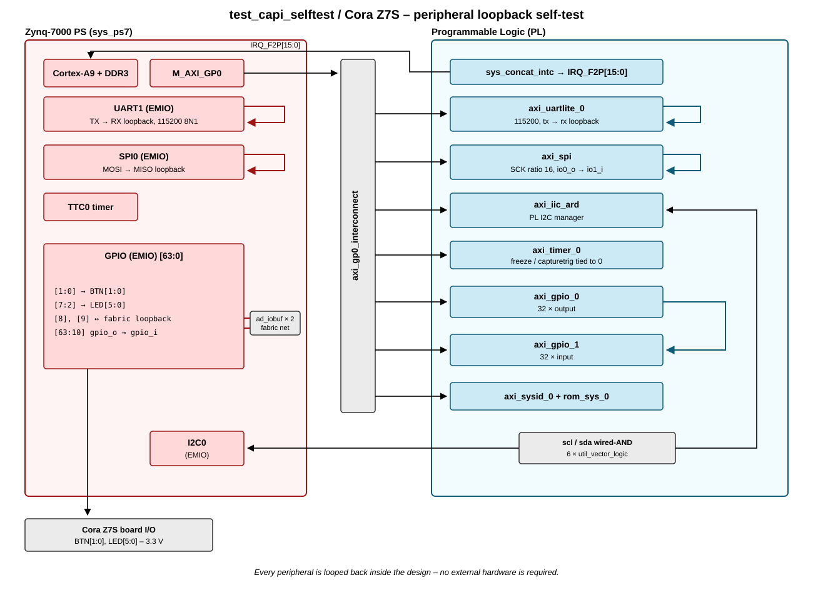

.. _test_capi_selftest:

TEST-CAPI-SELFTEST HDL project
===============================================================================

The **test_capi_selftest** project is a self-contained verification design. It
does not target an evaluation board and it does not talk to any external
device. Instead, it instantiates the peripheral controllers that a software
platform layer has to drive - SPI, UART, I2C, timer and GPIO - both in the
Processing System (PS) and in the Programmable Logic (PL), and loops each one
of them back onto itself inside the FPGA.

Because every transmitter is wired to its own receiver, software running on the
carrier can write a pattern through a peripheral, read it back through the same
peripheral and decide whether the driver - and the C API (CAPI) layer
underneath it - behaves as expected. No cables, no jumpers and no daughter
board are required, which makes the design usable for automated regression
runs.

The interfaces exercised by the design are:

.. list-table::
   :widths: 20 40 40
   :header-rows: 1

   * - Interface
     - PS instance
     - PL instance
   * - SPI
     - SPI0 (EMIO), MOSI looped to MISO
     - ``axi_spi``, ``io0_o`` looped to ``io1_i``
   * - UART
     - UART1 (EMIO), TX looped to RX
     - ``axi_uartlite_0``, ``tx`` looped to ``rx``
   * - I2C
     - I2C0 (EMIO)
     - ``axi_iic_ard``
   * - Timer
     - TTC0
     - ``axi_timer_0``
   * - GPIO
     - EMIO GPIO, bit 9 looped to bit 8 through the fabric
     - ``axi_gpio_0`` (output) looped to ``axi_gpio_1`` (input)

The two I2C managers are the exception to the one-peripheral-one-loopback rule:
they are tied together on a single emulated open-drain bus, so a transfer
started by one manager is observed by the other. The design contains no I2C
subordinate.

Supported boards
-------------------------------------------------------------------------------

- None. The design is fully self-contained and requires no evaluation board.

Supported devices
-------------------------------------------------------------------------------

- None.

Supported carriers
-------------------------------------------------------------------------------

.. list-table::
   :widths: 35 35 30
   :header-rows: 1

   * - Evaluation board
     - Carrier
     - FMC slot
   * - \-
     - `Cora Z7S <https://digilent.com/shop/cora-z7-zynq-7000-single-core-for-arm-fpga-soc-development>`__
     - \-

The Arduino shield headers of the Cora Z7S are not used by this project; the
only pins constrained at the top level are the two push buttons and the six
LEDs of the carrier. The design was tested in hardware with VIO set to 3.3 V.

Block design
-------------------------------------------------------------------------------

Block diagram
~~~~~~~~~~~~~~~~~~~~~~~~~~~~~~~~~~~~~~~~~~~~~~~~~~~~~~~~~~~~~~~~~~~~~~~~~~~~~~~

The peripherals and their loopback paths are depicted in the below diagram:

Clock scheme
~~~~~~~~~~~~~~~~~~~~~~~~~~~~~~~~~~~~~~~~~~~~~~~~~~~~~~~~~~~~~~~~~~~~~~~~~~~~~~~

There is no external clock source and no clock generator in the design. Every
clock comes from the PS PLLs through the ``FCLK`` outputs, as configured by the
Cora Z7S base design.

.. list-table::
   :widths: 25 15 60
   :header-rows: 1

   * - Clock
     - Frequency
     - Used by
   * - ``sys_cpu_clk`` (FCLK_CLK0)
     - 100 MHz
     - AXI interconnect and every AXI peripheral, plus the
       ``ext_spi_clk`` input of ``axi_spi``
   * - ``sys_dma_clk`` (FCLK_CLK1)
     - 40 MHz
     - not used, the design has no DMA

Since ``axi_spi`` is configured with an SCK ratio of 16, the resulting
PL SPI clock is 6.25 MHz.

CPU/Memory interconnects addresses
~~~~~~~~~~~~~~~~~~~~~~~~~~~~~~~~~~~~~~~~~~~~~~~~~~~~~~~~~~~~~~~~~~~~~~~~~~~~~~~

The addresses are dependent on the architecture of the FPGA, having an offset
added to the base address from HDL (see more at :ref:`architecture cpu-intercon-addr`).

=============== ===========
Instance        Zynq
=============== ===========
axi_iic_ard*    0x4160_0000
axi_spi         0x44A0_0000
axi_uartlite_0  0x44A1_0000
axi_timer_0     0x44A2_0000
axi_gpio_0      0x44A3_0000
axi_gpio_1      0x44A4_0000
axi_sysid_0*    0x4500_0000
=============== ===========

.. admonition:: Legend
   :class: note

   ``*`` instantiated by the Cora Z7S base design

SPI connections
~~~~~~~~~~~~~~~~~~~~~~~~~~~~~~~~~~~~~~~~~~~~~~~~~~~~~~~~~~~~~~~~~~~~~~~~~~~~~~~

.. list-table::
   :widths: 15 25 60
   :header-rows: 1

   * - SPI type
     - SPI manager instance
     - Loopback
   * - PS
     - SPI0 (EMIO)
     - ``SPI0_MOSI_O`` connected to ``SPI0_MISO_I``
   * - PL
     - ``axi_spi``
     - ``io0_o`` connected to ``io1_i``; ``sck_i`` tied to 0, ``ss_i`` tied to
       1 and ``io0_i`` tied to 0

PS SPI1 is enabled on EMIO by the Cora Z7S base design, but this project leaves
it unconnected at the top level.

I2C connections
~~~~~~~~~~~~~~~~~~~~~~~~~~~~~~~~~~~~~~~~~~~~~~~~~~~~~~~~~~~~~~~~~~~~~~~~~~~~~~~

.. list-table::
   :widths: 15 25 20 40
   :header-rows: 1

   * - I2C type
     - I2C manager instance
     - Alias
     - I2C subordinate
   * - PS
     - I2C0 (EMIO)
     - \-
     - none, the bus is shared with the PL manager
   * - PL
     - axi_iic
     - ``axi_iic_ard``
     - none, the bus is shared with the PS manager

The ``iic_ard`` interface port created by the Cora Z7S base design is removed,
and the two managers are joined by an open-drain bus model built out of six
``util_vector_logic`` instances (three per line, for ``scl`` and ``sda``): each
manager's output enable and output data are OR-ed to obtain its released/driven
state, and the two results are AND-ed to obtain the wired-AND bus level, which
is then fed back to both managers' inputs.

UART connections
~~~~~~~~~~~~~~~~~~~~~~~~~~~~~~~~~~~~~~~~~~~~~~~~~~~~~~~~~~~~~~~~~~~~~~~~~~~~~~~

.. list-table::
   :widths: 15 25 20 40
   :header-rows: 1

   * - UART type
     - UART instance
     - Baud rate
     - Loopback
   * - PS
     - UART1 (EMIO)
     - 115200
     - ``UART1_TX`` connected to ``UART1_RX``
   * - PL
     - ``axi_uartlite_0``
     - 115200
     - ``tx`` connected to ``rx``

Timers
~~~~~~~~~~~~~~~~~~~~~~~~~~~~~~~~~~~~~~~~~~~~~~~~~~~~~~~~~~~~~~~~~~~~~~~~~~~~~~~

Two timers are available: the PS TTC0, which is re-enabled by this project, and
the PL ``axi_timer_0``. The unused inputs of the latter (``freeze``,
``capturetrig0`` and ``capturetrig1``) are tied to 0.

GPIOs
~~~~~~~~~~~~~~~~~~~~~~~~~~~~~~~~~~~~~~~~~~~~~~~~~~~~~~~~~~~~~~~~~~~~~~~~~~~~~~~

Two independent GPIO paths are provided.

The PL path is a pure register-to-register loopback: ``axi_gpio_0`` is
configured as 32 outputs, ``axi_gpio_1`` as 32 inputs, and the whole 32-bit
output vector is connected to the input vector.

The PS path uses the EMIO GPIO of the ``sys_ps7`` instance, 64 bits wide. Bits
0 to 7 leave the FPGA towards the carrier buttons and LEDs, bits 8 and 9 are
strapped together through a pair of ``ad_iobuf`` instances on an internal
fabric net, and the remaining bits are looped back directly from ``gpio_o`` to
``gpio_i``.

.. list-table::
   :widths: 25 20 20 20
   :header-rows: 2

   * - GPIO signal
     - Direction
     - HDL GPIO EMIO
     - Software GPIO
   * -
     - (from FPGA view)
     -
     - Zynq-7000
   * - BTN0
     - IN
     - 0
     - 54
   * - BTN1
     - IN
     - 1
     - 55
   * - LED0_B
     - OUT
     - 2
     - 56
   * - LED0_R
     - OUT
     - 3
     - 57
   * - LED0_G
     - OUT
     - 4
     - 58
   * - LED1_B
     - OUT
     - 5
     - 59
   * - LED1_R
     - OUT
     - 6
     - 60
   * - LED1_G
     - OUT
     - 7
     - 61
   * - GPIO loopback receiver
     - IN
     - 8
     - 62
   * - GPIO loopback driver
     - OUT
     - 9
     - 63
   * - unused, directly looped back
     - \-
     - 10 to 63
     - 64 to 117

Interrupts
~~~~~~~~~~~~~~~~~~~~~~~~~~~~~~~~~~~~~~~~~~~~~~~~~~~~~~~~~~~~~~~~~~~~~~~~~~~~~~~

Below are the Programmable Logic interrupts used in this project.

============== === ========== ===========
Instance name  HDL Linux Zynq Actual Zynq
============== === ========== ===========
axi_spi        8   52         84
axi_uartlite_0 9   53         85
axi_timer_0    10  54         86
axi_iic_ard*   11  55         87
axi_gpio_0     12  56         88
axi_gpio_1     13  57         89
============== === ========== ===========

.. admonition:: Legend
   :class: note

   ``*`` connected by the Cora Z7S base design

Building the HDL project
-------------------------------------------------------------------------------

The design is built upon ADI's generic HDL reference design framework. ADI makes
the sources available on the :git-hdl:`HDL repository </>`. To get the source
you must
`clone <https://git-scm.com/book/en/v2/Git-Basics-Getting-a-Git-Repository>`__
the HDL repository, and then build the project as follows:

**Linux/Cygwin/WSL**

Building the Cora Z7S project:

.. shell::

   $cd hdl/projects/test_capi_selftest/coraz7s
   $make

A more comprehensive build guide can be found in the :ref:`build_hdl` user guide.

Resources
-------------------------------------------------------------------------------

HDL related
~~~~~~~~~~~~~~~~~~~~~~~~~~~~~~~~~~~~~~~~~~~~~~~~~~~~~~~~~~~~~~~~~~~~~~~~~~~~~~~

- :git-hdl:`TEST-CAPI-SELFTEST HDL project source code <projects/test_capi_selftest>`

.. list-table::
   :widths: 30 35 35
   :header-rows: 1

   * - IP name
     - Source code link
     - Documentation link
   * - AXI_SYSID
     - :git-hdl:`library/axi_sysid`
     - :ref:`axi_sysid`
   * - SYSID_ROM
     - :git-hdl:`library/sysid_rom`
     - :ref:`axi_sysid`

Besides the ADI IPs above, the design uses only AMD LogiCORE IPs, all of them
delivered with Vivado: ``processing_system7``, ``axi_quad_spi``,
``axi_uartlite``, ``axi_timer``, ``axi_gpio``, ``axi_iic``, ``axi_interconnect``,
``proc_sys_reset``, ``util_vector_logic`` and ``xlconcat``.

Software related
~~~~~~~~~~~~~~~~~~~~~~~~~~~~~~~~~~~~~~~~~~~~~~~~~~~~~~~~~~~~~~~~~~~~~~~~~~~~~~~

The project is meant to be driven by bare-metal software; no Linux device tree
is provided for it. The peripheral drivers and the platform C API exercised by
this design live in the :git-no-os:`No-OS repository </>`.

.. include:: ../common/more_information.rst

.. include:: ../common/support.rst
