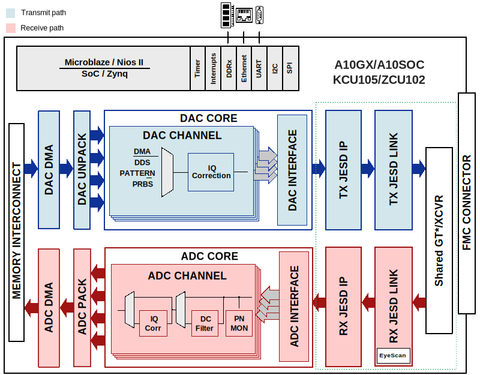

.. _architecture:

HDL Architecture
===============================================================================

Every HDL design of a reference project can be divided into two
subsystems:

-  **Base design** --- description of what the **carrier** contains:

   -  an embedded processor - soft or hard
   -  all the peripheral IPs (that are necessary to run a Linux
      distribution on the system)
   -  these designs are specific to each carrier, making them **carrier
      dependent**
   -  it describes part of the ``system_wrapper`` module
   -  located in
      :git-hdl:`projects/common <projects/common>`;
      one for each carrier

-  **Board design** --- description of what the **board** attached to
   the carrier contains:

   -  all the necessary IPs needed to support the board
   -  these designs are common to all carriers, making them **carrier
      independent**
   -  it describes part of the ``system_wrapper`` module
   -  located in ``hdl/projects/$project_name/common/*bd.tcl``

How they're instantiated
-------------------------------------------------------------------------------

In case of a project, inside the ``system_bd.tcl`` file, we have to source
the *base design first*, then the *board design*.

Example
~~~~~~~~~~~~~~~~~~~~~~~~~~~~~~~~~~~~~~~~~~~~~~~~~~~~~~~~~~~~~~~~~~~~~~~~~~~~~~~

Take `AD-FMCOMMS2-EBZ`_ with ZedBoard; the ``system_bd.tcl`` will look like the
following:

.. code-block:: bash

   source $ad_hdl_dir/projects/common/zed/zed_system_bd.tcl
   source ../common/fmcomms2_bd.tcl

Typical project diagram
-------------------------------------------------------------------------------

|HDL overall system|

Base Design
-------------------------------------------------------------------------------

The base design contains all the I/O peripherals, memory interfaces
and processing components, which are necessary for a fully functional
Linux system. The majority of these components are Intel and AMD Xilinx IP
cores.

Usually, they contain:

-  Microprocessor
-  Memory interface controller
-  Peripheral interfaces

Microprocessor
~~~~~~~~~~~~~~~~~~~~~~~~~~~~~~~~~~~~~~~~~~~~~~~~~~~~~~~~~~~~~~~~~~~~~~~~~~~~~~~

In our designs, we use only two types:

.. list-table::
   :widths: 20 20 20 20 20
   :header-rows: 2

   * - Intel
     -
     - AMD Xilinx
     -
     -
   * - **SoC**
     - **FPGA**
     - **SoC**
     - **FPGA**
     - `ACAP`_
   * - `HPS`_
     - `NIOS II`_
     - `PS7`_
       `PS8`_
     - `MicroBlaze`_
     - `Versal`_

.. _ACAP: https://www.xilinx.com/an/adaptive-compute-acceleration-platforms.html
.. _HPS: https://www.intel.com/content/www/us/en/docs/programmable/683458/current/hard-processor-system-hps.html
.. _NIOS II: https://www.intel.com/content/www/us/en/products/programmable/processor/nios-ii.html
.. _PS7: https://www.xilinx.com/products/intellectual-property/processing_system7.html
.. _PS8: https://www.xilinx.com/products/intellectual-property/zynq-ultra-ps-e.html
.. _MicroBlaze: https://www.xilinx.com/products/design-tools/microblaze.html
.. _Versal: https://www.xilinx.com/products/silicon-devices/acap/versal.html

Worth mentioning in case of SoCs, the **Hard Processor System** (HPS)
or **Processing System 7/8** (PS7/8) do not contain just the dual-core
ARM® Cortex® - A9 MPCore™ processor, they also have other integrated
peripherals and memory interfaces. For more information please visit
the manufacturer's website, listed in the table above.

-  ``PS7`` --- `Zynq-7000 SoC Processing
   System <https://docs.xilinx.com/v/u/en-US/pg082-processing-system7>`__
   (``processing_system7``)
-  ``PS8`` --- `Zynq UltraScale+ MPSoC Processing
   System <https://docs.xilinx.com/viewer/book-attachment/xFC3qkokxbD~75kj6nPLuw/2o4flzqn5OqWHaMHwpG3Qg>`__
   (``zynq_ultra_ps_e``)
-  ``Versal`` --- `Versal ACAP
   CIPS <https://docs.xilinx.com/r/en-US/pg352-cips/Overview>`__
   (``versal_cips``)

Memory Interface Controller
~~~~~~~~~~~~~~~~~~~~~~~~~~~~~~~~~~~~~~~~~~~~~~~~~~~~~~~~~~~~~~~~~~~~~~~~~~~~~~~

In almost all cases, the carrier board is not made and designed by
Analog Devices, so the external memory solution of the system is given.
Meaning we can not support, modify or alter this important part of the
system, in several cases we even have system limitations because of it
(e.g. the memory interface is not fast enough to handle the required
data throughput).

Under the two links below the user can find the landing page of the
available memory solutions for both Intel and AMD:

-  Intel's memory interfaces:
   https://www.intel.com/content/www/us/en/programmable/support/support-resources/external-memory.html
-  AMD's memory interfaces:
   https://www.xilinx.com/products/intellectual-property/mig.html#documentation

Peripheral interfaces
~~~~~~~~~~~~~~~~~~~~~~~~~~~~~~~~~~~~~~~~~~~~~~~~~~~~~~~~~~~~~~~~~~~~~~~~~~~~~~~

These interfaces are used to control external peripherals located on
the prototyping board or the FMC IO board.

In HDL, these ports are named slightly different than how they're in
the documentations. Thus, to make it easier for beginners, here you
have the naming of the ports depending on the microprocessor used.

CPU/Memory interconnects addresses
^^^^^^^^^^^^^^^^^^^^^^^^^^^^^^^^^^^^^^^^^^^^^^^^^^^^^^^^^^^^^^^^^^^^^^^^^^^^^^^

The memory addresses that will be used by software are based on the HDL
addresses of the IP register map, to which an offset is added, depending
on the architecture of the used FPGA (see also :git-hdl:`ad_cpu_interconnect
procedure <projects/scripts/adi_board.tcl>`; architecture is
specified by ``sys_zynq`` variable, for AMD FPGAs).

**Zynq-7000 and 7 Series**

Because this was the original target, this is the reference
address used, the common one, to which depending on the architecture,
you add an offset to get to the address space for the peripherals (as they
differ from one to the other).

**Zynq UltraScale+ MP**

If the address is between 0x4000_0000 - 0x4FFF_FFFF then the
AXI peripherics will be placed in 0x8000_0000 - 0x8FFF_FFFF range
by adding 0x4000_0000 to the address.

If the address is between 0x7000_0000 - 0x7FFF_FFFF then the
AXI peripherics will be placed in 0x9000_0000 - 0x9FFF_FFFF range
by adding 0x2000_0000 to the address.

**Versal**

If the address is between 0x4400_0000 - 0x4FFF_FFFF then the
AXI peripherics will be placed in 0xA400_0000 - 0xAFFF_FFFF range
by adding 0x6000_0000 to the address.

If the address is between 0x7000_0000 - 0x7FFF_FFFF then the
AXI peripherics will be placed in 0xB000_0000 - 0xBFFF_FFFF range
by adding 0x4000_0000 to the address.

SPI
^^^^^^^^^^^^^^^^^^^^^^^^^^^^^^^^^^^^^^^^^^^^^^^^^^^^^^^^^^^^^^^^^^^^^^^^^^^^^^^

In general, the base system has two Serial Peripheral Interfaces, which
are used as a control interface for FMC/HSMC devices. These SPI
interfaces are controlled by the integrated SPI controller of the **Hard
Processor System** (HPS) or **Processing System 7/8** (PS7/8) or an
Intel or AMD SPI controller core.

I2C/I2S/SPDIF
^^^^^^^^^^^^^^^^^^^^^^^^^^^^^^^^^^^^^^^^^^^^^^^^^^^^^^^^^^^^^^^^^^^^^^^^^^^^^^^

A couple of carrier boards require these standard interfaces for
different purposes, for example, a configuration interface for an audio
peripheral device. These peripherals do not necessarily have vital roles
in the reference design, it's more like a generic goal to support all
the provided peripherals of the carrier board.

HDMI
^^^^^^^^^^^^^^^^^^^^^^^^^^^^^^^^^^^^^^^^^^^^^^^^^^^^^^^^^^^^^^^^^^^^^^^^^^^^^^^

There is HDMI support for all the carriers which are using the ADV7511
as HDMI transmitter. The HDMI transmitter core can be found
:git-hdl:`here <library/axi_hdmi_tx>`.

GPIOs
^^^^^^^^^^^^^^^^^^^^^^^^^^^^^^^^^^^^^^^^^^^^^^^^^^^^^^^^^^^^^^^^^^^^^^^^^^^^^^^

The general rule of thumb is to define 64 GPIO pins for the base design:

-  bits [31: 0] always belong to the carrier board;
-  bits [63:32] will be assigned to switches, buttons and/or LEDs, which
   can be found on the FMC board.
-  bits [95:64] will be used when the FPGA type is Zynq UltraScale+
   MPSoC

When some of these GPIOs are not used, the input pins should have the
output pins driven to them, so that Vivado will not complain about
inputs not being assigned to.

Depending on the processor type, add these values to the GPIO number
from the HDL project to obtain the final number used in software:

-  PS7 EMIO offset = 54
-  PS8 EMIO offset = 78

Connectivity
^^^^^^^^^^^^^^^^^^^^^^^^^^^^^^^^^^^^^^^^^^^^^^^^^^^^^^^^^^^^^^^^^^^^^^^^^^^^^^^

-  Ethernet
-  USB OTG

These interfaces designs are borrowed from the golden reference design
of the board.

Interrupts
~~~~~~~~~~~~~~~~~~~~~~~~~~~~~~~~~~~~~~~~~~~~~~~~~~~~~~~~~~~~~~~~~~~~~~~~~~~~~~~

When developing the Linux software parts for an HDL project, the
interrupts number to the PS have a different number in the software
side.

Not a rule, but in our designs we preffer to use firstly the interrupts
from 15 and to go down to 0. Be careful when assigning one, because it
might be used in the base design of the carrier!

Always check which are used (in
``/projects/common/$carrier/$carrier_system_bd.tcl``)

Interrupts table
^^^^^^^^^^^^^^^^^^^^^^^^^^^^^^^^^^^^^^^^^^^^^^^^^^^^^^^^^^^^^^^^^^^^^^^^^^^^^^^

=== ========== =========== ============ ============= ====== =============== ================
HDL Linux Zynq Actual Zynq Linux ZynqMP Actual ZynqMP S10SoC Linux Cyclone V Actual Cyclone V
=== ========== =========== ============ ============= ====== =============== ================
15  59         91          111          143           32     55              87
14  58         90          110          142           31     54              86
13  57         89          109          141           30     53              85
12  56         88          108          140           29     52              84
11  55         87          107          139           28     51              83
10  54         86          106          138           27     50              82
9   53         85          105          137           26     49              81
8   52         84          104          136           25     48              80
7   36         68          96           128           24     47              79
6   35         67          95           127           23     46              78
5   34         66          94           126           22     45              77
4   33         65          93           125           21     44              76
3   32         64          92           124           20     43              75
2   31         63          91           123           19     42              74
1   30         62          90           122           18     41              73
0   29         61          89           121           17     40              72
=== ========== =========== ============ ============= ====== =============== ================

Board design and capabilities
-------------------------------------------------------------------------------

AMD platforms
~~~~~~~~~~~~~~~~~~~~~~~~~~~~~~~~~~~~~~~~~~~~~~~~~~~~~~~~~~~~~~~~~~~~~~~~~~~~~~~

.. list-table::
   :widths: 16 16 18 18 16 16
   :header-rows: 1

   * - Board name
     - Boots from
     - FMC connector 1
     - FMC connector 2
     - VADJ FMC connector
     - Family
   * - `AC701 <https://www.xilinx.com/products/boards-and-kits/ek-a7-ac701-g.html>`__
     - JTAG
     - HPC (2 GTP @ 6.6 Gbps)
     - ---
     - 3.3V/**\*2.5V**/1.8V
     - Artix-7
   * - `Cora Z7-07S <https://digilent.com/reference/programmable-logic/cora-z7/start>`__
     - SD card
     - ---
     - ---
     - ---
     - Zynq-7000
   * - `KC705 <https://www.xilinx.com/products/boards-and-kits/ek-k7-kc705-g.html>`__
     - JTAG
     - HPC (4 GTX @ 10.3125 Gbps)
     - LPC (1 GTX @ 10.3125 Gbps)
     - 3.3V/**\*2.5V**/1.8V
     - Kintex-7
   * - `KCU105 <https://www.xilinx.com/products/boards-and-kits/kcu105.html>`__
     - JTAG
     - HPC (8 GTH @ 16.3 Gbps)
     - LPC (1 GTH @ 16.3 Gbps)
     - **\*1.8V**/1.5V/1.2V
     - Kintex UltraScale
   * - `Microzed <http://zedboard.org/product/microzed>`__
     - JTAG
     - ---
     - ---
     - ---
     - Zynq-7000
   * - `VC707 <https://www.xilinx.com/products/boards-and-kits/ek-v7-vc707-g.html>`__
     - JTAG
     - HPC (8 GTX @ 12.5 Gbps)
     - HPC (8 GTX @ 12.5 Gbps)
     - **\*1.8V**/1.5V/1.2V
     - Virtex-7
   * - `VC709 <https://www.xilinx.com/products/boards-and-kits/dk-v7-vc709-g.html>`__
     - JTAG
     - HPC (10 GTH @ 13.1 Gbps)
     - ---
     - **\*1.8V**
     - Virtex-7
   * - `VCK190 <https://www.xilinx.com/products/boards-and-kits/vck190.html>`__
     - SD card
     - FMC+ (12 GTY @ 28.21 Gbps)
     - FMC+ (12 GTY @ 28.21 Gbps)
     - **\*1.5V**/1.2V
     - Versal AI Core
   * - `VCU118 <https://www.xilinx.com/products/boards-and-kits/vcu118.html>`__
     - JTAG
     - FMC+ (24 GTY @ 28.21 Gbps)
     - LPC
     - **\*1.8V**/1.5V/1.2V
     - Virtex UltraScale+
   * - `VCU128 <https://www.xilinx.com/products/boards-and-kits/vcu128.html>`__
     - JTAG
     - FMC+ (24 GTY @ 28.21 Gbps)
     - ---
     - **\*1.8V**/1.5V/1.2V
     - Virtex UltraScale+ HBM
   * - `VMK180 <https://www.xilinx.com/products/boards-and-kits/vmk180.html>`__
     - SD card
     - FMC+ (12 GTY @ 28.21 Gbps)
     - FMC+ (12 GTY @ 28.21 Gbps)
     - **\*1.5V**/1.2V
     - Versal Prime Series
   * - `ZC702 <https://www.xilinx.com/products/boards-and-kits/ek-z7-zc702-g.html>`__
     - SD card
     - LPC
     - LPC
     - 3.3V/**\*2.5V**/1.8V
     - Zynq-7000
   * - `ZC706 <https://www.xilinx.com/products/boards-and-kits/ek-z7-zc706-g.html>`__
     - SD card
     - HPC (8 GTX @ 10.3125 Gbps)
     - LPC (1 GTX @ 10.3125 Gbps)
     - 3.3V/**\*2.5V**/1.8V
     - Zynq-7000
   * - `ZCU102 <https://www.xilinx.com/products/boards-and-kits/ek-u1-zcu102-es2-g.html>`__
     - SD card
     - HPC (8 GTH @ 16.3 Gbps)
     - HPC (8 GTH @ 16.3 Gbps)
     - **\*1.8V**/1.5V/1.2V
     - Zynq UltraScale+ MP SoC
   * - `ZedBoard <https://www.avnet.com/wps/portal/us/products/avnet-boards/avnet-board-families/zedboard/>`__
     - SD card
     - LPC
     - ---
     - 3.3V/2.5V/**\*1.8V**
     - Zynq-7000

.. note::

   The column with the VADJ value applies to the FMC connectors when they
   exist. If both of them exist, then it is the same for both of them.
   If there is only one FMC connector, then it applies to only one.
   If both are missing, then a --- (dash) will appear.

.. note::

   **(\* bold**) = default VADJ
   FMC1 & FMC2 columns -> depending on the power supply of the device
   connected to the FMC, the custom VADJ will have the value supported by
   both the carrier and the device(s)

Intel platforms
~~~~~~~~~~~~~~~~~~~~~~~~~~~~~~~~~~~~~~~~~~~~~~~~~~~~~~~~~~~~~~~~~~~~~~~~~~~~~~~

.. list-table::
   :widths: 20 40 40
   :header-rows: 1

   * - Board name
     - FMC connector 1
     - FMC connector 2
   * - `A10GX <https://www.altera.com/products/boards_and_kits/dev-kits/altera/kit-a10-gx-fpga.html>`__
     - LPC ()
     - HPC (8 x 17.4 Gbps)
   * - `A10SoC <https://www.altera.com/products/boards_and_kits/dev-kits/altera/arria-10-soc-development-kit.html>`__
     - HPC (8)
     - LPC (8)
   * - `S10SoC <https://www.intel.com/content/www/us/en/products/details/fpga/development-kits/stratix/10-sx.html>`__
     - FMC+ (24 @ 28.3 Gbps)
     - FMC+ (24 @ 28.3 Gbps)

VADJ values
^^^^^^^^^^^^^^^^^^^^^^^^^^^^^^^^^^^^^^^^^^^^^^^^^^^^^^^^^^^^^^^^^^^^^^^^^^^^^^^

.. list-table::
   :widths: 20 40 40
   :header-rows: 1

   * - Board name
     - FMC connector 1
     - FMC connector 2
   * - `A10GX <https://www.altera.com/products/boards_and_kits/dev-kits/altera/kit-a10-gx-fpga.html>`__
     - **\*1.8V**/1.5V/1.35V/1.2V
     - **\*1.8V**/1.5V/1.35V/1.2V
   * - `A10SoC <https://www.altera.com/products/boards_and_kits/dev-kits/altera/arria-10-soc-development-kit.html>`__
     - **\*1.8V**/1.5V/1.35V/1.25V/1.2V/1.1V
     - **\*1.8V**/1.5V/1.35V/1.2V/1.1V
   * - `S10SoC <https://www.intel.com/content/www/us/en/products/details/fpga/development-kits/stratix/10-sx.html>`__
     - **\*3.3V**/1.8V/1.2V
     - **\*3.3V**/1.8V/1.2V

(**\* bold**) = default VADJ
FMC1 & FMC2 columns -> depending on the power supply of the device
connected to the FMC, the custom VADJ will have the value supported by
both the carrier and the device(s)

File structure of a project
-------------------------------------------------------------------------------

.. tip::

   In ``/projects/common/$carrier_name/`` you can find templates for the
   *system_top.v*, *Makefile*, etc. to help you when creating a new project.

Project files for AMD boards
~~~~~~~~~~~~~~~~~~~~~~~~~~~~~~~~~~~~~~~~~~~~~~~~~~~~~~~~~~~~~~~~~~~~~~~~~~~~~~~

A project for an AMD FPGA board should contain the following files:

-  ``Makefile`` --- auto-generated file; contains all the IP
   dependencies needed for the project to be built

-  ``system_project.tcl`` --- script that creates the actual Vivado
   project and runs the synthesis/implementation of the design

-  ``system_bd.tcl`` --- sources the *base design first*, then the
   *board design*, and afterwards it contains all the IP instances and
   connections that must be added on top of the sourced files, to
   complete the design of the project (these are specific to the
   combination of this carrier and board)

-  ``system_constr.xdc`` --- constraints file of the design; it’s the
   connection between the physical pins of the FPGA that you want to use
   and the HDL code that describes the behavior; here you define the FMC
   I/O pins, board-specific clock signals, timing constraints, etc. The
   constraints specific to the carrier are imported in the
   *system_project.tcl* file

-  ``system_top.v`` --- contains everything about the HDL part of the
   project; it instantiates the ``system_wrapper`` module, IO buffers,
   I/ODDRs, modules that transform signals from LVDS to single-ended,
   etc. The I/O ports of this Verilog module will be connected to actual
   I/O pads of the FPGA.

   -  ``system_wrapper`` --- is a tool generated file and can be found at
      ``<project_name>.srcs/sources_1/bd/system/hdl/system_wrapper.v``

      -  the I/O ports of this module are declared in either
         *system_bd.tcl* or in the **board** design file
      -  this can be visualized in Vivado at the Block Design section
      -  the base design, board design and system_bd.tcl describe this
         module, making the connections between the instantiated IPs

Project files for Intel boards
~~~~~~~~~~~~~~~~~~~~~~~~~~~~~~~~~~~~~~~~~~~~~~~~~~~~~~~~~~~~~~~~~~~~~~~~~~~~~~~

A project for an Intel FPGA board should contain the following files:

-  ``Makefile`` --- auto-generated file; contains all the IP
   dependencies needed for the project to be built

-  ``system_project.tcl`` --- script that creates the actual Quartus
   project and runs the synthesis/implementation of the design. It also
   contains the I/O definitions for the interfaces between the board and
   the FPGA

-  ``system_qsys.tcl`` --- also called **platform designer**; sources
   the *base design first*, then the *board design*, and afterwards it
   contains all the IP instances and connections that must be added on
   top of the sourced files, to complete the design of the project
   (these are specific to the combination of this carrier and board)

-  ``system_constr.sdc`` --- contains clock definitions and other path
   constraints

-  ``system_top.v`` --- contains everything about the HDL part of the
   project; it instantiates the ``system_wrapper`` module, IO buffers,
   I/ODDRs, modules that transform signals from LVDS to single-ended,
   etc. The I/O ports of this Verilog module will be connected to actual
   I/O pads of the FPGA

Examples
^^^^^^^^^^^^^^^^^^^^^^^^^^^^^^^^^^^^^^^^^^^^^^^^^^^^^^^^^^^^^^^^^^^^^^^^^^^^^^^

Some carriers have a different name for these files, for example A10SoC
has constraints file for both PL side and PS side:

-  a10soc_plddr4_assign.tcl --- constraints file for the PL
-  a10soc_system_assign.tcl --- constraints file for the PS

.. _AD-FMCOMMS2-EBZ: https://www.analog.com/en/design-center/evaluation-hardware-and-software/evaluation-boards-kits/EVAL-AD-FMCOMMS2.html

