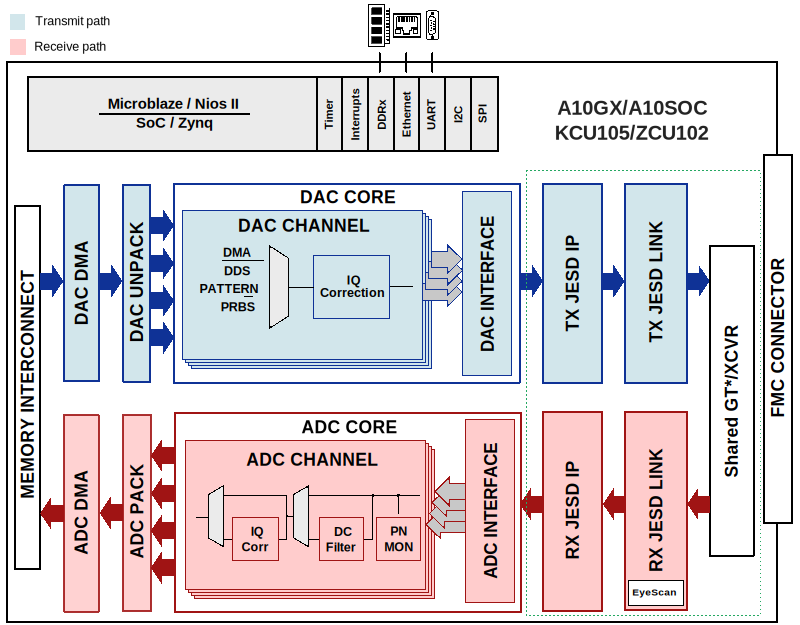

.. _architecture:

HDL Architecture
===============================================================================

Every HDL design of a reference project can be divided into:

#. Base design for the **carrier** board (projects/common/$CARRIER) ---
   description of what the carrier contains

   - an embedded processor - soft or hard;
   - all the peripheral IPs (that are necessary to run a Linux distribution
     on the system);
   - these designs are specific to each carrier, making them **carrier
     dependent**;
   - it describes part of the ``system_wrapper`` module;
   - located in :git-hdl:`projects/common`; one for each carrier;
   - here we do most of the PS configuration, add SPI, I2C and GPIOs;
   - in some cases, we have scripts to instantiate the PL DDR as ADC offload
     memory or DAC offload memory.

#. Base design for the **evaluation** board (projects/$EVAL_BOARD/common)
   --- description of what the evaluation contains

   - instantiates all the necessary IPs to control the evaluation board and to
     capture or send data;
   - the data paths defined in this block design are common across multiple
     carrier platforms, making them **carrier independent**;
   - it describes part of the ``system_wrapper`` module;
   - located at ``hdl/projects/$EVAL_BOARD/common`` (``*_bd.tcl`` for
     AMD Xilinx FPGAs, and ``*_qsys.tcl`` for Intel FPGAs).

#. Specific design for the system (projects/$EVAL_BOARD/$CARRIER)

   - we source the carrier board configuration (#1), then the evaluation
     board configuration (#2) and then we do some specific parameter
     modification, if required.

How they're instantiated
-------------------------------------------------------------------------------

In case of a project, inside the ``system_bd.tcl`` file we have to source
the base design of the carrier first (#1), then the base design of the
evaluation board (#2).

Example
~~~~~~~~~~~~~~~~~~~~~~~~~~~~~~~~~~~~~~~~~~~~~~~~~~~~~~~~~~~~~~~~~~~~~~~~~~~~~~~

Take :adi:`FMCOMMS2 <AD-FMCOMMS2-EBZ>` with
:xilinx:`ZedBoard <products/boards-and-kits/1-8dyf-11.html>`;
the ``system_bd.tcl`` file will have the following designs sourced to be used:

.. code-block:: tcl

   source $ad_hdl_dir/projects/common/zed/zed_system_bd.tcl
   source ../common/fmcomms2_bd.tcl

Typical project diagram
-------------------------------------------------------------------------------

Base Design
-------------------------------------------------------------------------------

The base design contains all the I/O peripherals, memory interfaces
and processing components, which are necessary for a fully functional
Linux system. The majority of these components are Intel and AMD Xilinx IP
cores.

Usually, they contain:

- Microprocessor
- Memory interface controller
- Peripheral interfaces

Microprocessor
~~~~~~~~~~~~~~~~~~~~~~~~~~~~~~~~~~~~~~~~~~~~~~~~~~~~~~~~~~~~~~~~~~~~~~~~~~~~~~~

In our designs, we use only three types:

.. list-table::
   :header-rows: 2

   * - Intel
     -
     - AMD Xilinx
     -
     -
     - Lattice
   * - **SoC**
     - **FPGA**
     - **SoC**
     - **FPGA**
     - `ACAP`_
     - **FPGA**
   * - `HPS`_
     - `NIOS II`_
     - `PS7`_
       `PS8`_
     - `MicroBlaze`_
     - `Versal`_
     - `riscv-rx`_

.. _ACAP: https://www.xilinx.com/an/adaptive-compute-acceleration-platforms.html
.. _HPS: https://www.intel.com/content/www/us/en/docs/programmable/683458/current/hard-processor-system-hps.html
.. _NIOS II: https://www.intel.com/content/www/us/en/products/programmable/processor/nios-ii.html
.. _PS7: https://www.xilinx.com/products/intellectual-property/processing_system7.html
.. _PS8: https://www.xilinx.com/products/intellectual-property/zynq-ultra-ps-e.html
.. _MicroBlaze: https://www.xilinx.com/products/design-tools/microblaze.html
.. _Versal: https://www.xilinx.com/products/silicon-devices/acap/versal.html
.. _riscv-rx: https://www.latticesemi.com/products/designsoftwareandip/intellectualproperty/ipcore/ipcores04/risc-v-rx-cpu

Worth mentioning in case of SoCs, the **Hard Processor System** (HPS)
or **Processing System 7/8** (PS7/8) do not contain just the dual-core
ARM® Cortex® - A9 MPCore™ processor, they also have other integrated
peripherals and memory interfaces. For more information please visit
the manufacturer's website, listed in the table above.

- ``PS7`` --- `Zynq-7000 SoC Processing
  System <https://docs.xilinx.com/v/u/en-US/pg082-processing-system7>`__
  (``processing_system7``)
- ``PS8`` --- `Zynq UltraScale+ MPSoC Processing
  System <https://docs.xilinx.com/viewer/book-attachment/xFC3qkokxbD~75kj6nPLuw/2o4flzqn5OqWHaMHwpG3Qg>`__
  (``zynq_ultra_ps_e``)
- ``Versal`` --- `Versal ACAP
  CIPS <https://docs.xilinx.com/r/en-US/pg352-cips/Overview>`__
  (``versal_cips``)

Memory interface controller
~~~~~~~~~~~~~~~~~~~~~~~~~~~~~~~~~~~~~~~~~~~~~~~~~~~~~~~~~~~~~~~~~~~~~~~~~~~~~~~

In almost all cases, the carrier board is not made and designed by
:adi:`Analog Devices <>`, so the external memory solution of the system is
given.

Meaning, **we cannot support, modify or alter this important part** of the
system. In several cases we even have system limitations because of it
(e.g. the memory interface is not fast enough to handle the required
data throughput).

In the following two links, one can find the landing page of the available
memory solutions for Intel and AMD:

- Intel's memory interfaces:
  https://www.intel.com/content/www/us/en/programmable/support/support-resources/external-memory.html
- AMD's memory interfaces:
  https://www.xilinx.com/products/intellectual-property/mig.html#documentation

Peripheral interfaces
~~~~~~~~~~~~~~~~~~~~~~~~~~~~~~~~~~~~~~~~~~~~~~~~~~~~~~~~~~~~~~~~~~~~~~~~~~~~~~~

These interfaces are used to control external peripherals located on
the prototyping board or the FMC I/O board.

In HDL, these ports are named slightly different than how they're in
the documentations. Thus, to make it easier for beginners, here you
have the naming of the ports depending on the microprocessor used.

.. _architecture cpu-intercon-addr:

CPU/Memory interconnects addresses
^^^^^^^^^^^^^^^^^^^^^^^^^^^^^^^^^^^^^^^^^^^^^^^^^^^^^^^^^^^^^^^^^^^^^^^^^^^^^^^

The memory addresses that will be used by software are based on the HDL
addresses of the IP register map, to which an offset is added, depending
on the architecture of the used FPGA (see also
:git-hdl:`ad_cpu_interconnect procedure <projects/scripts/adi_board.tcl>`;
architecture is specified by ``sys_zynq`` variable, for AMD FPGAs).

**Zynq-7000 and 7 Series**

Because this was the original target, this is the reference
address used, the common one, to which depending on the architecture,
you add an offset to get to the address space for the peripherals (as they
differ from one to the other).

**Zynq UltraScale+ MP**

If the address is between 0x4000_0000 - 0x4FFF_FFFF then the
AXI peripherics will be placed in 0x8000_0000 - 0x8FFF_FFFF range
by adding 0x4000_0000 to the address.

If the address is between 0x7000_0000 - 0x7FFF_FFFF then the
AXI peripherics will be placed in 0x9000_0000 - 0x9FFF_FFFF range
by adding 0x2000_0000 to the address.

**Versal**

If the address is between 0x4400_0000 - 0x4FFF_FFFF then the
AXI peripherics will be placed in 0xA400_0000 - 0xAFFF_FFFF range
by adding 0x6000_0000 to the address.

If the address is between 0x7000_0000 - 0x7FFF_FFFF then the
AXI peripherics will be placed in 0xB000_0000 - 0xBFFF_FFFF range
by adding 0x4000_0000 to the address.

**Intel**

Applying to DE10-Nano, C5SoC.

The address usually (but not always) starts from 0x0002_0000, or the first
available block of a bigger size. In Quartus block design you should be
able to determine it.

SPI
^^^^^^^^^^^^^^^^^^^^^^^^^^^^^^^^^^^^^^^^^^^^^^^^^^^^^^^^^^^^^^^^^^^^^^^^^^^^^^^

In general, the base design of the carrier (#1) has two Serial Peripheral
Interfaces (SPIs), which are used as a control interface for FMC/HSMC devices.
These SPI interfaces are controlled by the integrated SPI controller of the
**Hard Processor System** (HPS) or **Processing System 7/8** (PS7/8) or an
Intel or AMD SPI controller core.

I2C/I2S/SPDIF
^^^^^^^^^^^^^^^^^^^^^^^^^^^^^^^^^^^^^^^^^^^^^^^^^^^^^^^^^^^^^^^^^^^^^^^^^^^^^^^

A couple of carriers require these standard interfaces for different purposes
(e.g. a configuration interface for an audio peripheral device).
These peripherals do not necessarily have vital roles in the reference
design -- it's more like a generic goal to support all the provided
peripherals of the carrier board.

HDMI
^^^^^^^^^^^^^^^^^^^^^^^^^^^^^^^^^^^^^^^^^^^^^^^^^^^^^^^^^^^^^^^^^^^^^^^^^^^^^^^

There is HDMI support for all carriers which are using the :adi:`ADV7511`
as HDMI transmitter. The HDMI transmitter core can be found
:git-hdl:`here (axi_hdmi_tx) <library/axi_hdmi_tx>`.

GPIOs
^^^^^^^^^^^^^^^^^^^^^^^^^^^^^^^^^^^^^^^^^^^^^^^^^^^^^^^^^^^^^^^^^^^^^^^^^^^^^^^

The general rule of thumb is to define 64 GPIO pins for the design:

- bits [31: 0] always belong to the carrier board;
- bits [63:32] will be assigned to switches, buttons and/or LEDs, which
  can be found on the FMC board;
- bits [95:64] will be used when the FPGA type is Zynq UltraScale+ MPSoC.

When some of these GPIOs are not used, the input pins should have the
output pins driven to them, so that
:xilinx:`Vivado <products/design-tools/vivado.html>` will not complain about
inputs not being assigned to.

Depending on the processor type, add these values to the GPIO number
from the HDL project to obtain the final number used in software:

- PS7 EMIO offset = **54**
- PS8 EMIO offset = **78**
- MicroBlaze offset = **no offset**
- Versal offset = **-32**

Connectivity
^^^^^^^^^^^^^^^^^^^^^^^^^^^^^^^^^^^^^^^^^^^^^^^^^^^^^^^^^^^^^^^^^^^^^^^^^^^^^^^

- Ethernet
- USB OTG

These interface designs are borrowed from the golden reference design
of the board.

Interrupts
~~~~~~~~~~~~~~~~~~~~~~~~~~~~~~~~~~~~~~~~~~~~~~~~~~~~~~~~~~~~~~~~~~~~~~~~~~~~~~~

When developing the Linux software parts for an HDL project, the
interrupts number to the PS have a different number in the software
side.

Not a rule, but in our designs we preffer to use firstly the interrupts
from 15 and to go down to 0. Be careful when assigning one, because it
might be used in the base design of the carrier!

Always check which are used (in
``/projects/common/$carrier/$carrier_system_bd.tcl``)

Interrupts table
^^^^^^^^^^^^^^^^^^^^^^^^^^^^^^^^^^^^^^^^^^^^^^^^^^^^^^^^^^^^^^^^^^^^^^^^^^^^^^^

=== ========== =========== ============ ============= ====== =============== ================
HDL Linux Zynq Actual Zynq Linux ZynqMP Actual ZynqMP S10SoC Linux Cyclone V Actual Cyclone V
=== ========== =========== ============ ============= ====== =============== ================
15  59         91          111          143           32     55              87
14  58         90          110          142           31     54              86
13  57         89          109          141           30     53              85
12  56         88          108          140           29     52              84
11  55         87          107          139           28     51              83
10  54         86          106          138           27     50              82
9   53         85          105          137           26     49              81
8   52         84          104          136           25     48              80
7   36         68          96           128           24     47              79
6   35         67          95           127           23     46              78
5   34         66          94           126           22     45              77
4   33         65          93           125           21     44              76
3   32         64          92           124           20     43              75
2   31         63          91           123           19     42              74
1   30         62          90           122           18     41              73
0   29         61          89           121           17     40              72
=== ========== =========== ============ ============= ====== =============== ================

=== ==============
HDL riscv-rx no-OS
=== ==============
15  15
14  14
13  13
12  12
11  11
10  10
9   9
8   8
7   7
6   6
5   5
4   4
3   3
2   2
1   1
0   0
=== ==============

Board design and capabilities
-------------------------------------------------------------------------------

.. _architecture amd-platforms:

AMD platforms
~~~~~~~~~~~~~~~~~~~~~~~~~~~~~~~~~~~~~~~~~~~~~~~~~~~~~~~~~~~~~~~~~~~~~~~~~~~~~~~

The board files of these carriers can be found :git-hdl:`here <projects/common>`.

.. list-table::
   :widths: 16 16 18 18 16 16
   :header-rows: 1

   * - Board name
     - Boots from
     - FMC connector 1
     - FMC connector 2
     - VADJ FMC connector
     - Family
   * - :xilinx:`AC701` **
     - JTAG
     - HPC (2 GTP @ 6.6 Gbps)
     - ---
     - 3.3V/**\*2.5V**/1.8V
     - Artix-7
   * - `Cora Z7S <https://digilent.com/shop/cora-z7-zynq-7000-single-core-for-arm-fpga-soc-development>`__
     - SD card
     - ---
     - ---
     - ---
     - Zynq-7000
   * - :xilinx:`KCU105`
     - JTAG
     - HPC (8 GTH @ 16.3 Gbps)
     - LPC (1 GTH @ 16.3 Gbps)
     - **\*1.8V**/1.5V/1.2V
     - Kintex UltraScale
   * - `Microzed <https://www.avnet.com/americas/products/avnet-boards/avnet-board-families/microzed>`__ **
     - JTAG
     - ---
     - ---
     - ---
     - Zynq-7000
   * - :xilinx:`VC709` **
     - JTAG
     - HPC (10 GTH @ 13.1 Gbps)
     - ---
     - **\*1.8V**
     - Virtex-7
   * - :xilinx:`VCK190`
     - SD card
     - FMC+ (12 GTY @ 28.21 Gbps)
     - FMC+ (12 GTY @ 28.21 Gbps)
     - **\*1.5V**/1.2V
     - Versal AI Core
   * - :xilinx:`VCU118`
     - JTAG
     - FMC+ (24 GTY @ 28.21 Gbps)
     - LPC
     - **\*1.8V**/1.5V/1.2V
     - Virtex UltraScale+
   * - :xilinx:`VMK180`
     - SD card
     - FMC+ (12 GTY @ 28.21 Gbps)
     - FMC+ (12 GTY @ 28.21 Gbps)
     - **\*1.5V**/1.2V
     - Versal Prime Series
   * - :xilinx:`VPK180`
     - SD card
     - FMC+ (8 GTYP @ 32.75 Gbps)
     - ---
     - **\*1.5V**/1.2V
     - Versal Premium
   * - :xilinx:`ZC702`
     - SD card
     - LPC
     - LPC
     - 3.3V/**\*2.5V**/1.8V
     - Zynq-7000
   * - :xilinx:`ZCU102`
     - SD card
     - HPC (8 GTH @ 16.3 Gbps)
     - HPC (8 GTH @ 16.3 Gbps)
     - **\*1.8V**/1.5V/1.2V
     - Zynq UltraScale+ MP SoC
   * - `ZedBoard <https://digilent.com/shop/zedboard-zynq-7000-arm-fpga-soc-development-board>`__
     - SD card
     - LPC
     - ---
     - 3.3V/2.5V/**\*1.8V**
     - Zynq-7000
   * - `LFCPNX-EVN <https://www.latticesemi.com/en/Products/DevelopmentBoardsAndKits/CertusPro-NXEvaluationBoard>`__
     - JTAG | SPI flash
     - HPC
     - ---
     - ---
     - CertusPro-NX

.. note::

   The column with the VADJ value applies to the FMC connectors when they
   exist. If both of them exist, then it is the same for both of them.
   If there is only one FMC connector, then it applies to only one.
   If both are missing, then a --- (dash) will appear.

.. note::

   \*\* = not supported anymore, but projects with these carriers can be found
   in older releases

.. note::

   **(\* bold**) = default VADJ
   FMC1 & FMC2 columns -> depending on the power supply of the device
   connected to the FMC, the custom VADJ will have the value supported by
   both the carrier and the device(s)

Discontinued AMD platforms
~~~~~~~~~~~~~~~~~~~~~~~~~~~~~~~~~~~~~~~~~~~~~~~~~~~~~~~~~~~~~~~~~~~~~~~~~~~~~~~

Projects with these carriers can still be found on our repository, as well as
their :git-hdl:`board files <projects/common>`.

.. list-table::
   :widths: 16 16 18 18 16 16
   :header-rows: 1

   * - Board name
     - Boots from
     - FMC connector 1
     - FMC connector 2
     - VADJ FMC connector
     - Family
   * - :xilinx:`KC705`
     - JTAG
     - HPC (4 GTX @ 10.3125 Gbps)
     - LPC (1 GTX @ 10.3125 Gbps)
     - 3.3V/**\*2.5V**/1.8V
     - Kintex-7
   * - :xilinx:`VC707`
     - JTAG
     - HPC (8 GTX @ 12.5 Gbps)
     - HPC (8 GTX @ 12.5 Gbps)
     - **\*1.8V**/1.5V/1.2V
     - Virtex-7
   * - :xilinx:`VCU128`
     - JTAG
     - FMC+ (24 GTY @ 28.21 Gbps)
     - ---
     - **\*1.8V**/1.5V/1.2V
     - Virtex UltraScale+ HBM
   * - :xilinx:`ZC706`
     - SD card
     - HPC (8 GTX @ 10.3125 Gbps)
     - LPC (1 GTX @ 10.3125 Gbps)
     - 3.3V/**\*2.5V**/1.8V
     - Zynq-7000

.. _architecture intel-platforms:

Intel platforms
~~~~~~~~~~~~~~~~~~~~~~~~~~~~~~~~~~~~~~~~~~~~~~~~~~~~~~~~~~~~~~~~~~~~~~~~~~~~~~~

.. list-table::
   :widths: 20 40 40
   :header-rows: 1

   * - Board name
     - Connector 1
     - Connector 2
   * - :intel:`A10GX <content/www/us/en/products/details/fpga/development-kits/arria/10-gx.html>` ** (Arria 10 GX)
     - FMC LPC ()
     - FMC HPC (8 x 17.4 Gbps)
   * - :intel:`A10SoC <content/www/us/en/products/details/fpga/development-kits/arria/10-sx.html>` (Arria 10 SoC)
     - FMC HPC (8)
     - FMC LPC (8)
   * - :intel:`S10SoC </content/www/us/en/products/details/fpga/development-kits/stratix/10-sx.html>` (Stratix 10 SoC)
     - FMC+ (24 @ 28.3 Gbps)
     - FMC+ (24 @ 28.3 Gbps)
   * - :intel:`C5SoC <content/www/us/en/products/details/fpga/development-kits/cyclone/v-sx.html>` (Cyclone V SoC)
     - HSMC
     - ---
   * - :intel:`DE10-Nano <content/www/us/en/developer/topic-technology/edge-5g/hardware/fpga-de10-nano.html>`
     - Arduino shield
     - ---
   * - :intel:`FM87 <content/www/us/en/products/details/fpga/development-kits/agilex/si-agi027.html>` (Agilex 7 I-Series)
     - FMC+ (16 @ 32 Gbps)
     - FMC+ (16 @ 32 Gbps)

.. note::

   \*\* = not supported anymore, but projects with these carriers can be found
   in older releases

VADJ values
^^^^^^^^^^^^^^^^^^^^^^^^^^^^^^^^^^^^^^^^^^^^^^^^^^^^^^^^^^^^^^^^^^^^^^^^^^^^^^^

.. list-table::
   :widths: 20 40 40
   :header-rows: 1

   * - Board name
     - FMC connector 1
     - FMC connector 2
   * - :intel:`A10GX <content/www/us/en/products/details/fpga/development-kits/arria/10-gx.html>`
     - **\*1.8V**/1.5V/1.35V/1.2V
     - **\*1.8V**/1.5V/1.35V/1.2V
   * - :intel:`A10SoC <content/www/us/en/products/details/fpga/development-kits/arria/10-sx.html>`
     - **\*1.8V**/1.5V/1.35V/1.25V/1.2V/1.1V
     - **\*1.8V**/1.5V/1.35V/1.2V/1.1V
   * - :intel:`S10SoC </content/www/us/en/products/details/fpga/development-kits/stratix/10-sx.html>`
     - **\*3.3V**/1.8V/1.2V
     - **\*3.3V**/1.8V/1.2V
   * - :intel:`FM87 <content/www/us/en/products/details/fpga/development-kits/agilex/si-agi027.html>`
     - **\*1.2V**
     - **\*1.2V**

.. note::

   (**\* bold**) = default VADJ
   FMC1 & FMC2 columns -> depending on the power supply of the device
   connected to the FMC, the custom VADJ will have the value supported by
   both the carrier and the device(s)

Memory Specifications
-------------------------------------------------------------------------------

This section documents the on-chip and external memory resources of each
supported carrier.

.. important::

   **This section is a work in progress.**

   - Data was pulled from a large number of user guides, device datasheets,
     and technical reference manuals. **Mistakes or gaps are possible**.
   - Memory configurations **can vary between board revisions** so what is
     listed here may not match your specific revision.

   Always cross-reference with the official documentation for your board
   before making any design decisions based on these numbers.

On-Chip Memory
~~~~~~~~~~~~~~~~~~~~~~~~~~~~~~~~~~~~~~~~~~~~~~~~~~~~~~~~~~~~~~~~~~~~~~~~~~~~~~~

- **BRAM** and **UltraRAM** reside in the programmable logic fabric and are
  fully available to HDL designs.
- **UltraRAM** (288 Kb blocks) is present only on UltraScale+ and Versal
  devices.
- Lattice CertusPro-NX provides **EBR** (18 Kb) and **LRAM** (512 Kb) blocks.
- Intel Arria 10 / Stratix 10 / Agilex 7 use **M20K** (20 Kb) blocks while
  Cyclone V uses **M10K** (10 Kb) blocks.
- The **PS/HPS OCM SRAM** is a fixed block inside the processor subsystem
  (Zynq-7000, Zynq UltraScale+ MPSoC, Versal) shared between the APU/application
  processors and PL via the OCM interconnect. Cyclone V and Agilex 7 HPS include
  a smaller 64 KB or 256 KB OCRAM used by the preloader before DDR initialisation.

AMD platforms
^^^^^^^^^^^^^^^^^^^^^^^^^^^^^^^^^^^^^^^^^^^^^^^^^^^^^^^^^^^^^^^^^^^^^^^^^^^^^^^

.. list-table::
   :header-rows: 1
   :widths: 17 18 28 22 15

   * - Board
     - Family
     - BRAM (PL)
     - UltraRAM (PL)
     - PS OCM SRAM
   * - :xilinx:`ZCU102`
     - Zynq UltraScale+ MPSoC
     - 912 x 36 Kb (~32 Mb)
     - ---
     - 256 KB
   * - :xilinx:`VCK190`
     - Versal AI Core
     - 967 x 36 Kb (~34 Mb)
     - 463 x 288 Kb (~130 Mb)
     - 256 KB
   * - :xilinx:`VMK180`
     - Versal Prime
     - 967 x 36 Kb (~34 Mb)
     - 463 x 288 Kb (~130 Mb)
     - 256 KB
   * - :xilinx:`VPK180`
     - Versal Premium
     - 4,941 x 36 Kb (~174 Mb)
     - 2,549 x 288 Kb (~717 Mb)
     - 256 KB
   * - :xilinx:`VCU118`
     - Virtex UltraScale+
     - 2,160 x 36 Kb (~76 Mb)
     - 960 x 288 Kb (~270 Mb)
     - ---
   * - :xilinx:`KCU105`
     - Kintex UltraScale
     - 600 x 36 Kb (~21 Mb)
     - ---
     - ---
   * - :xilinx:`ZC702`
     - Zynq-7000
     - 140 x 36 Kb (~5 Mb)
     - ---
     - 256 KB
   * - `ZedBoard <https://digilent.com/shop/zedboard-zynq-7000-arm-fpga-soc-development-board>`__
     - Zynq-7000
     - 140 x 36 Kb (~5 Mb)
     - ---
     - 256 KB
   * - :xilinx:`AC701` **
     - Artix-7
     - 365 x 36 Kb (~13 Mb)
     - ---
     - ---
   * - `Cora Z7S <https://digilent.com/shop/cora-z7-zynq-7000-single-core-for-arm-fpga-soc-development>`__
     - Zynq-7000
     - 60 x 36 Kb (Z7-10) / 50 x 36 Kb (Z7-07S)
     - ---
     - 256 KB
   * - `Microzed <https://www.avnet.com/americas/products/avnet-boards/avnet-board-families/microzed>`__ **
     - Zynq-7000
     - 140 x 36 Kb (7Z020) / 60 x 36 Kb (7Z010)
     - ---
     - 256 KB
   * - :xilinx:`VC709` **
     - Virtex-7
     - 1,470 x 36 Kb (~52 Mb)
     - ---
     - ---
   * - `LFCPNX-EVN <https://www.latticesemi.com/en/Products/DevelopmentBoardsAndKits/CertusPro-NXEvaluationBoard>`__
     - CertusPro-NX (Lattice)
     - 208 x 18 Kb EBR (~3.7 Mb) + 7 x 512 Kb LRAM (~3.5 Mb)
     - ---
     - ---

Discontinued AMD platforms
^^^^^^^^^^^^^^^^^^^^^^^^^^^^^^^^^^^^^^^^^^^^^^^^^^^^^^^^^^^^^^^^^^^^^^^^^^^^^^^

.. list-table::
   :header-rows: 1
   :widths: 17 18 28 22 15

   * - Board
     - Family
     - BRAM (PL)
     - UltraRAM (PL)
     - PS OCM SRAM
   * - :xilinx:`KC705`
     - Kintex-7
     - 445 x 36 Kb (~16 Mb)
     - ---
     - ---
   * - :xilinx:`VC707`
     - Virtex-7
     - 1,030 x 36 Kb (~37 Mb)
     - ---
     - ---
   * - :xilinx:`VCU128`
     - Virtex UltraScale+ HBM
     - 2,016 x 36 Kb (~71 Mb)
     - 960 x 288 Kb (~270 Mb) + HBM2 8 GB
     - ---
   * - :xilinx:`ZC706`
     - Zynq-7000
     - 545 x 36 Kb (~19.2 Mb)
     - ---
     - 256 KB

Intel platforms
^^^^^^^^^^^^^^^^^^^^^^^^^^^^^^^^^^^^^^^^^^^^^^^^^^^^^^^^^^^^^^^^^^^^^^^^^^^^^^^

Intel SoC FPGAs (Arria 10, Stratix 10, Cyclone V, Agilex) include HPS
on-chip RAM (OCRAM) used by the preloader before external DDR is initialised.

.. list-table::
   :header-rows: 1
   :widths: 22 18 40 20

   * - Board
     - Family
     - Fabric BRAM
     - HPS On-Chip RAM
   * - :intel:`A10GX <content/www/us/en/products/details/fpga/development-kits/arria/10-gx.html>` **
     - Arria 10 GX
     - 2,713 M20K blocks (~53 Mb)
     - ---
   * - :intel:`A10SoC <content/www/us/en/products/details/fpga/development-kits/arria/10-sx.html>`
     - Arria 10 SoC
     - 2,131 M20K blocks (~42 Mb) + 9,260 MLAB blocks (~6 Mb)
     - 256 KB
   * - :intel:`S10SoC </content/www/us/en/products/details/fpga/development-kits/stratix/10-sx.html>`
     - Stratix 10 SX SoC
     - 11,721 M20K blocks (~229 Mb) + 45 Mbit eSRAM
     - 256 KB
   * - :intel:`C5SoC <content/www/us/en/products/details/fpga/development-kits/cyclone/v-sx.html>`
     - Cyclone V SX SoC
     - 553 M10K blocks (~5.4 Mb) + 994 MLAB blocks (~0.6 Mb)
     - 64 KB
   * - :intel:`DE10-Nano <content/www/us/en/developer/topic-technology/edge-5g/hardware/fpga-de10-nano.html>`
     - Cyclone V SE SoC
     - 553 M10K blocks (~5.4 Mb) + 994 MLAB blocks (~0.6 Mb)
     - 64 KB
   * - :intel:`FM87 <content/www/us/en/products/details/fpga/development-kits/agilex/si-agi027.html>`
     - Agilex 7 F-Series
     - 10,464 M20K (AGF023) / 13,272 M20K (AGF027)
     - 256 KB

External Memory
~~~~~~~~~~~~~~~~~~~~~~~~~~~~~~~~~~~~~~~~~~~~~~~~~~~~~~~~~~~~~~~~~~~~~~~~~~~~~~~

  - **PS-side / HPS-side** memory is connected to the hard processor system
    and is the primary DRAM for Linux.
  - **PL-side / Fabric-side** memory is connected directly to FPGA fabric
    I/O banks and is available for HDL data-path designs.
  - On **Versal** devices there is no hard PS/PL split; all DDR interfaces
    connect via the Network on Chip (NoC).

.. note::

   **Bandwidth** figures in the tables below are computed as
   ``Rate (MT/s) × (effective data width in bytes)``.
   On 72-bit ECC interfaces (64-bit data + 8-bit ECC), only the
   64-bit / 8-byte data portion is counted - the ECC byte carries
   error-correction overhead, not user payload.
   Example: a 72-bit DDR4-2666 interface => 2,666 × 8 = ~21.3 GB/s,
   not 2,666 × 9 = ~24.0 GB/s.

AMD Supported
^^^^^^^^^^^^^^^^^^^^^^^^^^^^^^^^^^^^^^^^^^^^^^^^^^^^^^^^^^^^^^^^^^^^^^^^^^^^^^^

.. list-table::
   :header-rows: 1
   :widths: 11 14 9 8 9 11 17

   * - Board
     - Interface
     - Type
     - Size
     - Width
     - Rate (MT/s)
     - Bandwidth
   * - :xilinx:`ZCU102`
     - PS DDR4 SODIMM (J1)
     - DDR4
     - 4 GB
     - 64-bit
     - 2,666
     - ~21.3 GB/s
   * - :xilinx:`ZCU102`
     - PL DDR4 component (U2)
     - DDR4
     - 512 MB
     - 16-bit
     - 2,666
     - ~5.3 GB/s
   * - :xilinx:`VCK190`
     - DDR4 ECC UDIMM (J45)
     - DDR4
     - 8 GB
     - 72-bit
     - 3,200
     - ~25.6 GB/s
   * - :xilinx:`VCK190`
     - LPDDR4 Interfaces A+B (2x)
     - LPDDR4
     - 2 x 4 GB
     - 2x32-bit
     - 4,266
     - ~68.3 GB/s
   * - :xilinx:`VMK180`
     - DDR4 ECC UDIMM (J45)
     - DDR4
     - 8 GB
     - 72-bit
     - 3,200
     - ~25.6 GB/s
   * - :xilinx:`VMK180`
     - LPDDR4 Interfaces A+B (2x)
     - LPDDR4
     - 2 x 4 GB
     - 2x32-bit
     - 4,266
     - ~68.3 GB/s
   * - :xilinx:`VPK180`
     - LPDDR4 Triplets 1-3 (3x)
     - LPDDR4
     - 3 x 4 GB
     - 2x32-bit
     - 2,133
     - ~51.3 GB/s
   * - :xilinx:`VCU118`
     - PL DDR4 C1+C2 (U60-U64, U135-U139) (2x)
     - DDR4
     - 2 x 2.5 GB
     - 80-bit
     - 2,400
     - ~48.0 GB/s
   * - :xilinx:`VCU118`
     - PL RLD3 C3 (U141/U142)
     - RLDRAM3
     - 288 MB
     - 72-bit
     - 2,133
     - ~19.2 GB/s
   * - :xilinx:`KCU105`
     - PL DDR4 (U60-U63)
     - DDR4
     - 2 GB
     - 64-bit
     - 2,400
     - ~19.2 GB/s
   * - :xilinx:`ZC702`
     - PS DDR3 (U66-U69)
     - DDR3
     - 1 GB
     - 32-bit
     - 1,333
     - ~5.3 GB/s
   * - `ZedBoard <https://digilent.com/shop/zedboard-zynq-7000-arm-fpga-soc-development-board>`__
     - PS DDR3
     - DDR3
     - 512 MB
     - 32-bit
     - 1,066
     - ~4.3 GB/s
   * - :xilinx:`AC701` **
     - PL DDR3 SODIMM (J1)
     - DDR3
     - 1 GB
     - 64-bit
     - 1,600
     - ~12.8 GB/s
   * - `Cora Z7S <https://digilent.com/shop/cora-z7-zynq-7000-single-core-for-arm-fpga-soc-development>`__
     - PS DDR3L
     - DDR3L
     - 512 MB
     - 16-bit
     - 1,066
     - ~2.1 GB/s
   * - `Microzed <https://www.avnet.com/americas/products/avnet-boards/avnet-board-families/microzed>`__ **
     - PS DDR3
     - DDR3
     - 1 GB
     - 32-bit
     - 1,066
     - ~4.3 GB/s
   * - :xilinx:`VC709` **
     - PL DDR3 SODIMM J1+J3 (2x)
     - DDR3
     - 2 x 4 GB
     - 64-bit
     - 1,600
     - ~25.6 GB/s
   * - `LFCPNX-EVN <https://www.latticesemi.com/en/Products/DevelopmentBoardsAndKits/CertusPro-NXEvaluationBoard>`__
     - ---
     - ---
     - ---
     - ---
     - ---
     - No external DRAM **

.. note::

   ** The CertusPro-NX device itself supports LPDDR4, DDR3/3L and LPDDR2 up
   to 1,066 Mbps, but no DRAM is populated on the LFCPNX-EVN evaluation board.

Discontinued AMD platforms
^^^^^^^^^^^^^^^^^^^^^^^^^^^^^^^^^^^^^^^^^^^^^^^^^^^^^^^^^^^^^^^^^^^^^^^^^^^^^^^

.. list-table::
   :header-rows: 1
   :widths: 11 14 9 8 9 11 17

   * - Board
     - Interface
     - Type
     - Size
     - Width
     - Rate (MT/s)
     - Bandwidth
   * - :xilinx:`KC705`
     - PL DDR3 SODIMM (J1)
     - DDR3
     - 1 GB
     - 64-bit
     - 1,600
     - ~12.8 GB/s
   * - :xilinx:`VC707`
     - PL DDR3 SODIMM (J1)
     - DDR3
     - 1 GB
     - 64-bit
     - 1,600
     - ~12.8 GB/s
   * - :xilinx:`VCU128`
     - PL DDR4 (U17-U19/U73/U74)
     - DDR4
     - 4.5 GB
     - 72-bit
     - 2,666
     - ~24.0 GB/s
   * - :xilinx:`VCU128`
     - PL RLD3 (U37/U39)
     - RLDRAM3
     - 288 MB
     - 72-bit
     - 1,866
     - ~16.8 GB/s
   * - :xilinx:`VCU128`
     - HBM2 (on-die, 2 stacks)
     - HBM2
     - 8 GB
     - 2,048-bit
     - 1,800
     - ~460.8 GB/s
   * - :xilinx:`ZC706`
     - PS DDR3 (U2-U5)
     - DDR3
     - 1 GB
     - 32-bit
     - 1,333
     - ~5.3 GB/s
   * - :xilinx:`ZC706`
     - PL DDR3 SODIMM (J1)
     - DDR3
     - 1 GB
     - 64-bit
     - 1,600
     - ~12.8 GB/s

Intel platforms
^^^^^^^^^^^^^^^^^^^^^^^^^^^^^^^^^^^^^^^^^^^^^^^^^^^^^^^^^^^^^^^^^^^^^^^^^^^^^^^

.. list-table::
   :header-rows: 1
   :widths: 12 16 9 8 12 11 16

   * - Board
     - Interface
     - Type
     - Size
     - Width
     - Rate (MT/s)
     - Bandwidth
   * - :intel:`A10GX <content/www/us/en/products/details/fpga/development-kits/arria/10-gx.html>` **
     - via HiLo daughter card
     - DDR3L / DDR4
     - up to 4 GB
     - 72-bit
     - 2,133 / 2,666
     - ~19.2 / ~24.0 GB/s
   * - :intel:`A10SoC <content/www/us/en/products/details/fpga/development-kits/arria/10-sx.html>`
     - HPS DDR4 (HiLo)
     - DDR4
     - 1 GB
     - 40-bit (32+ECC)
     - 2,400
     - ~12.0 GB/s
   * - :intel:`A10SoC <content/www/us/en/products/details/fpga/development-kits/arria/10-sx.html>`
     - Fabric DDR4 (HiLo)
     - DDR4
     - 2 GB
     - 72-bit (64+ECC)
     - 2,400
     - ~19.2 GB/s
   * - :intel:`S10SoC </content/www/us/en/products/details/fpga/development-kits/stratix/10-sx.html>`
     - Fabric DDR4 SO-DIMM (J28)
     - DDR4
     - 16 GB
     - 72-bit (64+ECC)
     - 2,400
     - ~19.2 GB/s
   * - :intel:`S10SoC </content/www/us/en/products/details/fpga/development-kits/stratix/10-sx.html>`
     - HPS DDR4 (HiLo J13)
     - DDR4
     - 4 GB
     - 72-bit (64+ECC)
     - 2,133
     - ~17.1 GB/s
   * - :intel:`C5SoC <content/www/us/en/products/details/fpga/development-kits/cyclone/v-sx.html>`
     - HPS DDR3
     - DDR3
     - 1 GB
     - 32-bit
     - 800
     - ~3.2 GB/s
   * - :intel:`C5SoC <content/www/us/en/products/details/fpga/development-kits/cyclone/v-sx.html>`
     - Fabric DDR3
     - DDR3
     - 1 GB
     - 32-bit
     - 533
     - ~2.1 GB/s
   * - :intel:`DE10-Nano <content/www/us/en/developer/topic-technology/edge-5g/hardware/fpga-de10-nano.html>`
     - HPS DDR3
     - DDR3
     - 1 GB
     - 32-bit
     - 800
     - ~3.2 GB/s
   * - :intel:`FM87 <content/www/us/en/products/details/fpga/development-kits/agilex/si-agi027.html>`
     - HPS DDR4 (U15-U19)
     - DDR4
     - 1 GB (5 x x8 chips)
     - 40-bit (32+ECC)
     - 1,600
     - ~6.4 GB/s
   * - :intel:`FM87 <content/www/us/en/products/details/fpga/development-kits/agilex/si-agi027.html>`
     - Fabric DDR4 DIMM1 (J4)
     - DDR4 RDIMM
     - 16 GB
     - 72-bit (64+ECC)
     - 2,666
     - ~21.3 GB/s
   * - :intel:`FM87 <content/www/us/en/products/details/fpga/development-kits/agilex/si-agi027.html>`
     - Fabric DDR4 DIMM2 (J5)
     - DDR4 RDIMM
     - 16 GB
     - 72-bit (64+ECC)
     - 2,666
     - ~21.3 GB/s

.. note::

   - :intel:`A10GX <content/www/us/en/products/details/fpga/development-kits/arria/10-gx.html>`:
     **no DDR soldered on-board** - all DDR interfaces require an optional
     HiLo memory daughter card.
   - :intel:`S10SoC </content/www/us/en/products/details/fpga/development-kits/stratix/10-sx.html>`:
     the **HPS DDR4 HiLo card (J13) is not included** with the H-Tile kit
     and must be purchased separately.
   - :intel:`FM87 <content/www/us/en/products/details/fpga/development-kits/agilex/si-agi027.html>`:
     **DIMM2 (J5) is unpopulated** at the factory - socket only, available
     on the AGF027 variant only.

File structure of a project
-------------------------------------------------------------------------------

.. tip::

   In ``/projects/common/$carrier_name/`` you can find templates for the
   *system_top.v*, *Makefile*, etc. to help you when creating a new project.

Project files for AMD boards
~~~~~~~~~~~~~~~~~~~~~~~~~~~~~~~~~~~~~~~~~~~~~~~~~~~~~~~~~~~~~~~~~~~~~~~~~~~~~~~

A project for an AMD FPGA board should contain the following files:

- ``Makefile`` --- auto-generated file; contains all the IP
  dependencies needed for the project to be built
- ``system_project.tcl`` --- script that creates the actual Vivado
  project and runs the synthesis/implementation of the design
- ``system_bd.tcl`` --- sources the base design of the carrier first, then the
  base design of the evaluation board, and afterwards it contains all the IP
  instances and connections that must be added on top of the sourced files, to
  complete the design of the project (these are **specific** to the
  combination of this carrier and board)
- ``system_constr.xdc`` --- constraints file of the design; it's the
  connection between the physical pins of the FPGA and the HDL code
  that describes the behavior; here you define the FMC I/O pins,
  board-specific clock signals, timing constraints, etc. The
  constraints specific to the carrier are imported in the
  *system_project.tcl* file
- ``system_top.v`` --- contains everything about the HDL part of the
  project; it instantiates the ``system_wrapper`` module, I/O buffers,
  I/ODDRs, modules that transform signals from LVDS to single-ended,
  etc. The I/O ports of this Verilog module will be connected to actual
  I/O pads of the FPGA.

  - ``system_wrapper`` --- is a tool-generated file and can be found at
    ``<project_name>.srcs/sources_1/bd/system/hdl/system_wrapper.v``

    - the I/O ports of this module are declared in either
      *system_bd.tcl* or in the base design of the evaluation board (#2) file
    - this can be visualized in Vivado at the Block Design section
    - the base design, board design and system_bd.tcl describe this
      module, making the connections between the instantiated IPs

Project files for Intel boards
~~~~~~~~~~~~~~~~~~~~~~~~~~~~~~~~~~~~~~~~~~~~~~~~~~~~~~~~~~~~~~~~~~~~~~~~~~~~~~~

A project for an Intel FPGA board should contain the following files:

- ``Makefile`` --- auto-generated file; contains all the IP
  dependencies needed for the project to be built
- ``system_project.tcl`` --- script that creates the actual Quartus
  project and runs the synthesis/implementation of the design. It also
  contains the I/O definitions for the interfaces between the board and
  the FPGA
- ``system_qsys.tcl`` --- also called **platform designer**; sources the base
  design of the carrier first, then the base design of the evaluation board,
  and afterwards it contains all the IP instances and connections that must
  be added on top of the sourced files, to complete the design of the project
  (these are specific to the combination of this carrier and board)
- ``system_constr.sdc`` --- contains clock definitions and other path
  constraints
- ``system_top.v`` --- contains everything about the HDL part of the
  project; it instantiates the ``system_bd`` module, I/O buffers, specific
  SPI modules, modules that transform signals from LVDS to single-ended,
  etc. The I/O ports of this Verilog module will be connected to actual
  I/O pads of the FPGA

Examples
^^^^^^^^^^^^^^^^^^^^^^^^^^^^^^^^^^^^^^^^^^^^^^^^^^^^^^^^^^^^^^^^^^^^^^^^^^^^^^^

Some carriers have a different name for these files, for example A10SoC
has constraints file for both PL side and PS side:

- a10soc_plddr4_assign.tcl --- constraints file for the PL
- a10soc_system_assign.tcl --- constraints file for the PS

Project files for Lattice boards
~~~~~~~~~~~~~~~~~~~~~~~~~~~~~~~~~~~~~~~~~~~~~~~~~~~~~~~~~~~~~~~~~~~~~~~~~~~~~~~

A project for a Lattice FPGA board should contain the following files:

- ``Makefile`` --- auto-generated file; contains all the IP
  dependencies needed for the project to be built
- ``system_project_pb.tcl`` --- used to build the Propel Builder project
  (block design); linked in project-lattice.mk, run by propelbld (Windows),
  propelbldwrap (Linux);
- ``system_project.tcl`` --- used to build the Radiant project; Linked in
  project-lattice.mk, run by pnmainc (Windows), radiantc (Linux);
- ``system_pb.tcl`` --- linker script for the projects, sourced in
  adi_project_pb procedure that is called in system_project_pb.tcl and it is
  defined in adi_project_lattice_pb.tcl; sources the base design of the carrier
  first, then the base design of the evaluation board, and afterwards it
  contains all the IP instances and connections that must be added on top of
  the sourced files, to complete the design of the project (these are specific
  to the combination of this carrier and board)
- ``system_constr.sdc`` --- contains clock definitions and other path constraints
- ``system_constr.pdc`` --- contains clock definitions and other path
  constraints  + physical constraints
- ``system_top.v`` --- contains everything about the HDL part of the
  project; it instantiates the **<project_name>.v** ``system_wrapper`` module,
  I/O buffers, I/ODDRs, modules that transform signals from LVDS to single-ended,
  etc. The I/O ports of this Verilog module will be connected to actual
  I/O pads of the FPGA
