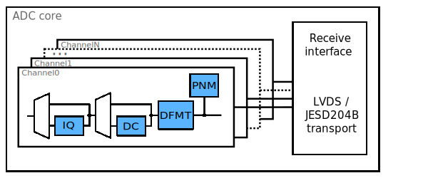
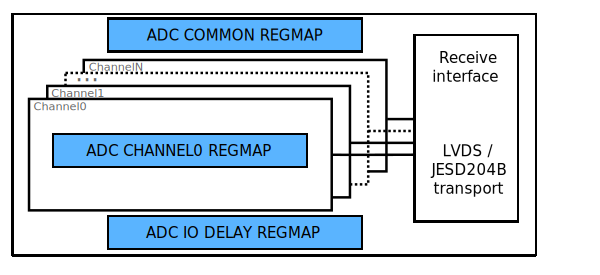

.. _axi_adc:

Generic AXI ADC
================================================================================

This page presents a generic framework, which is used to design
and develop an AXI based IP core for interfacing an Analog to Digital Converter
(ADC) device with a high speed serial (JESD204B) or source synchronous parallel
interface (LVDS/CMOS).
This is a generic framework, there can be minor differences on each and every IP,
the user should study this wiki page along with the IP's wiki page.

The main role of this page to ease the understanding of each ADC IP, and to
provide a base knowledge which can be used to develop new IPs for currently
unsupported devices.

.. important::

   Any kind of feedback regarding the ADC IP architecture or the following
   document is highly appreciated and can be addressed through the :ez:`fpga`
   community forum.

Files
--------------------------------------------------------------------------------

.. list-table::
   :header-rows: 1

   * - Name
     - Description
   * - :git-hdl:`library/common/up_adc_common.v`
     - Verilog source for the ADC Common regmap.
   * - :git-hdl:`library/common/up_adc_channel.v`
     - Verilog source for the ADC Channel regmap.

Architecture
--------------------------------------------------------------------------------

The main function of an AXI ADC IP is to handle all the low level signalling,
which is defined by the device's digital data interface, and to forward the
received data to a more simple FIFO interface. Beside this functionality there
are a few processing modules inside the data path of the core, which can be used
for signal conditioning. All these processing modules are optional, the are
enabled or disabled by setting the appropriate parameters.
The following block diagram presents a generic AXI ADC IP cores data path.

Receive PHY
~~~~~~~~~~~~~~~~~~~~~~~~~~~~~~~~~~~~~~~~~~~~~~~~~~~~~~~~~~~~~~~~~~~~~~~~~~~~~~~~

The most important part of the core is the Receive PHY module.
This module contains all the IO primitive instantiations and all the control
logic required to receive data from the device.

Currently the Receive PHY supports two different receive interface:

* :dokuwiki:`Source synchronous (CMOS or LVDS) interface <resources/fpga/docs/ssd_if>`
* :ref:`axi_jesd204_rx` [#f1]_

All these interfaces are supported on both Altera (Intel) and Xilinx devices.

This module is perfect choice for those, who wants a HDL logic for the device
interface, with a minimal resource footprint.

.. [#f1] The receive module contains just the Transport Layer of the JESD204B
   interface. Lower layers are implemented by other cores.

.. _axi_adc adc-channel:

ADC Channel
~~~~~~~~~~~~~~~~~~~~~~~~~~~~~~~~~~~~~~~~~~~~~~~~~~~~~~~~~~~~~~~~~~~~~~~~~~~~~~~~

* Data format module
* DC Offset correction module
* IQ correction module
* PN Monitor

ADC Core
~~~~~~~~~~~~~~~~~~~~~~~~~~~~~~~~~~~~~~~~~~~~~~~~~~~~~~~~~~~~~~~~~~~~~~~~~~~~~~~~

The ADC core is the top file of the IP core, the naming convention of this file
is: ``axi_<device_name>.v``.
Here are instantiated all the internal module discussed above, and a wrapper
module (up_axi), which converts the AXI interface into a more simplistic
addressable, memory mapped interface, so called :ref:`up_if` or uP interface.
This interface is used to interconnect the different memory mapped module pieces.

Interface
--------------------------------------------------------------------------------

A generic AXI ADC core have at least three different interfaces:

* The physical data interface (`LVDS <https://en.wikipedia.org/wiki/LVDS>`_ or
  `CMOS <https://en.wikipedia.org/wiki/CMOS>`_) or the JESD204B data interface
  from the link layer.
* Read FIFO interface of the receiver or sink module (e.g. DMA).
* AXI Slave Memory Mapped interface for register map access.

.. list-table:: LVDS or CMOS RX interface

   * - Pin
     - Type
     - Description
   * - ``rx_clk_in_[p|n]``
     - clock input
     - clock input
   * - ``rx_data_in_[p|n]``
     - input[resolution-1:0]
     - parallel data input
   * - ``rx_frame_in_[p|n]``
     - input
     - frame input signal (optional/device specific)
   * - ``rx_or_in_[p|n]``
     - input
     - over range input (optional/device specific)g

.. list-table:: JESD RX interface

   * - Pin
     - Type
     - Description
   * - ``rx_clk``
     - clock input
     - core clock
   * - ``rx_sof``
     - input[3:0]
     - start of frame signal
   * - ``rx_data``
     - input[DW-1:0]
     - data input; ``DW=32*MAX_LANE_NO``
   * - ``rx_ready``
     - output
     - ready, core always ready (tied to HIGH)
   * - ``rx_valid``
     - input
     - data valid

.. list-table:: Write FIFO interface

   * - Pin
     - Type
     - Description
   * - ``adc_clk``
     - clock output
     - Interface's clock signal
   * - ``adc_enable_0``
     - output
     - Enable signal for the first channel, asserted if channel is active
   * - ``adc_valid_0``
     - output
     - Data valid signal for the first channel, to validate data on the bus
   * - ``adc_data_0``
     - input[DW-1:0]
     - Data signal for the first channel
   * - ``adc_enable_x``
     - output
     - Enable signal for the channel x, asserted if channel is active
   * - ``adc_valid_x``
     - output
     - Data valid signal for the channel x, to validate data on the bus
   * - ``adc_data_x``
     - output[DW-1:0]
     - Data signal for the channel x
   * - ``adc_dovf``
     - input
     - Data overflow signal from the receiver or sink module (e.g DMA)
   * - ``adc_dunf``
     - input
     - Data underflow signal from the receiver or sink module (e.g DMA)

.. list-table:: AXI Memory Map Slave

   * - Pin
     - Type
     - Description
   * - ``s_axi_*``
     -
     - Standard AXI Slave Memory Map interface for register map access

Register Map
--------------------------------------------------------------------------------

The following block diagram presents the different register maps physical
location in the core. These register maps are generic and can be found in each
AXI ADC core.

The base and **ADC common** register map is implemented in the same verilog file.
It contains registers which controls and monitors the overall core, like:

* Reset bits
* Attributes of the receiver interface module
* DRP (Dynamic Reconfiguration Port) access for different IO resources (Clock
  Management Units, PLLs, Gigabit Transceivers etc.)
* Status registers (PN Monitor status, frequency of the interface clock)

.. note::

   The ADC Common register map is implemented in the
   :git-hdl:`library/common/up_adc_common.v` verilog file.
   To find the instantiation of this module search for ``up_adc_common`` inside
   the IP's directory.

The ADC Channel register map controls and monitors channel specific attributes.
Each channel of the core has an individual channel register map. It contains all
the registers, which are necessary to control and monitor the processing modules
of the data path. For detailed description of the available processing modules
see :ref:`axi_adc adc-channel` section.

.. note::

   The ADC Channel register map is implemented in the
   :git-hdl:`library/common/up_adc_channel.v` verilog file.
   To find the instantiation of this module search for ``up_adc_channel`` inside
   the IP's directory.

Typical Register Map base addresses
~~~~~~~~~~~~~~~~~~~~~~~~~~~~~~~~~~~~~~~~~~~~~~~~~~~~~~~~~~~~~~~~~~~~~~~~~~~~~~~~

.. hdl-regmap::
   :name: COMMON
   :no-type-info:

.. hdl-regmap::
   :name: ADC_COMMON
   :no-type-info:

.. hdl-regmap::
   :name: JESD_TPL
   :no-type-info:

.. hdl-regmap::
   :name: ADC_CHANNEL
   :no-type-info:

.. hdl-regmap::
   :name: IO_DELAY_CNTRL
   :no-type-info:

References
--------------------------------------------------------------------------------

* :dokuwiki:`AXI_AD9361 IP Description <resources/fpga/docs/axi_ad9361>`
