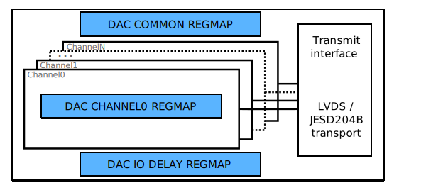

.. _axi_dac:

Generic AXI DAC
================================================================================

This page presents a generic framework, which is used to design
and develop an AXI based IP core for interfacing a Digital to Analog Converter
(DAC) device with a high speed serial (JESD204B) or source synchronous parallel
interface (LVDS/CMOS).
This is a generic framework, there can be minor differences on each and every IP,
the user should study this wiki page along with the IP's wiki page.

The main role of this page to ease the understanding of each DAC IP, and to
provide a base knowledge which can be used to develop new IPs for currently
unsupported devices.

.. important::

   Any kind of feedback regarding the DAC IP architecture or the following
   document is highly appreciated and can be addressed through the :ez:`fpga`
   community forum.

Files
--------------------------------------------------------------------------------

.. list-table::
   :header-rows: 1

   * - Name
     - Description
   * - :git-hdl:`library/common/up_dac_common.v`
     - Verilog source for the DAC Common regmap.
   * - :git-hdl:`library/common/up_dac_channel.v`
     - Verilog source for the DAC Channel regmap.

Architecture
--------------------------------------------------------------------------------

The main function of an AXI DAC IP is to handle all the low level signalling,
which is defined by the device's digital data interface, and to forward the
received data from the DMA or any other data source to the device. Beside this
functionality there are a few processing modules inside the data path of the
core, which can be used for signal conditioning. All these processing modules
are optional, the are enabled or disabled by setting the appropriate parameters.
The following block diagram presents a generic AXI DAC IP cores data path.

Transmit PHY
~~~~~~~~~~~~~~~~~~~~~~~~~~~~~~~~~~~~~~~~~~~~~~~~~~~~~~~~~~~~~~~~~~~~~~~~~~~~~~~~

The most important part of the core is the Transmit PHY module.
This module contains all the IO primitive instantiations and all the control
logic required to transmit data to the device.

.. note::

   All the PHY modules follows the same naming convention:
   ``axi_<device_name>_if.v`` (e.g. ``axi_ad9467_if.v``)

   In some cases, when the IP supports multiple interface type, the name of the
   PHY module look like: ``axi_<device_name>_<interface_type>_if.v``
   (e.g. ``axi_ad9361_lvds_if.v``)

Currently the Transmit PHY supports two different transmit interface:

* :dokuwiki:`Source synchronous (CMOS or LVDS) interface <resources/fpga/docs/ssd_if>`
* :ref:`axi_jesd204_tx` [#f1]_

All these interfaces are supported on both Altera (Intel) and Xilinx devices.

This module is perfect choice for those, who wants a HDL logic for the device
interface, with a minimal resource footprint.

.. [#f1] The transmit module contains just the Transport Layer of the JESD204B
   interface. Lower layers are implemented by other cores.

.. _axi_dac dac-channel:

DAC Channel
~~~~~~~~~~~~~~~~~~~~~~~~~~~~~~~~~~~~~~~~~~~~~~~~~~~~~~~~~~~~~~~~~~~~~~~~~~~~~~~~

* Data source multiplexer
* IQ correction module

DAC Core
~~~~~~~~~~~~~~~~~~~~~~~~~~~~~~~~~~~~~~~~~~~~~~~~~~~~~~~~~~~~~~~~~~~~~~~~~~~~~~~~

The DAC core is the top file of the IP core, the naming convention of this file
is: ``axi_<device_name>.v``.
Here are instantiated all the internal module discussed above, and a wrapper
module (up_axi), which converts the AXI interface into a more simplistic
addressable, memory mapped interface, so called :ref:`up_if` or uP interface.
This interface is used to interconnect the different memory mapped module pieces.

Interface
--------------------------------------------------------------------------------

A generic AXI DAC core have at least three different interfaces:

* The physical data interface (`LVDS <https://en.wikipedia.org/wiki/LVDS>`_ or
  `CMOS <https://en.wikipedia.org/wiki/CMOS>`_) or the JESD204B data interface
  from the link layer.
* Read FIFO interface for the transmit or source module (e.g. DMA).
* AXI Slave Memory Mapped interface for register map access.

.. list-table:: LVDS or CMOS TX interface

   * - Pin
     - Type
     - Description
   * - ``tx_clk_in_[p|n]``
     - clock input
     - clock input (device's DCO)
   * - ``tx_clk_out_[p|n]``
     - clock output
     -  clock output (device's DCI)
   * - ``tx_data_out_[p|n]``
     - output[resolution-1:0]
     - parallel data output (note that multiple parallel data buses can exist)

.. list-table:: JESD TX interface

   * - Pin
     - Type
     - Description
   * - ``tx_clk``
     - clock input
     - core clock or device clock (must be (line clock)/40)
   * - ``tx_data``
     - output[DW-1:0]
     - data input; ``DW=32*MAX_LANE_NO``

.. list-table:: Read FIFO interface

   * - Pin
     - Type
     - Description
   * - ``dac_clk``
     - clock output
     - Interface's clock signal
   * - ``dac_enable_0``
     - output
     - Enable signal for the first channel, asserted if channel is active
   * - ``dac_valid_0``
     - output
     - Data valid signal for the first channel, to validate data on the bus
   * - ``dac_data_0``
     - input[DW-1:0]
     - Data signal for the first channel
   * - ``dac_enable_x``
     - output
     - Enable signal for the channel x, asserted if channel is active
   * - ``dac_valid_x``
     - output
     - Data valid signal for the channel x, to validate data on the bus
   * - ``dac_data_x``
     - input[DW-1:0]
     - Data signal for the channel x
   * - ``dac_dunf``
     - input
     - Data underflow signal from the receiver or sink module (e.g DMA)

.. list-table:: AXI Memory Map Slave

   * - Pin
     - Type
     - Description
   * - ``s_axi_*``
     -
     - Standard AXI Slave Memory Map interface for register map access

Register Map
--------------------------------------------------------------------------------

The following block diagram presents the different register maps physical
location in the core. These register maps are generic and can be found in each
AXI DAC core.

The base and **DAC common** register map is implemented in the same verilog file.
It contains registers which controls and monitors the overall core, like:

* Reset bits
* Attributes of the transmit interface module
* DRP (Dynamic Reconfiguration Port) access for different IO resources (Clock
  Management Units, PLLs, Gigabit Transceivers etc.)
* Status registers (PN Monitor status, frequency of the interface clock)

.. note::

   The DAC Common register map is implemented in the
   :git-hdl:`library/common/up_dac_common.v` verilog file.
   To find the instantiation of this module search for ``up_dac_common`` inside
   the IP's directory.

The DAC Channel register map controls and monitors channel specific attributes.
Each channel of the core has an individual channel register map. It contains all
the registers, which are necessary to control and monitor the processing modules
of the data path. For detailed description of the available processing modules
see :ref:`axi_dac dac-channel` section.

.. note::

   The DAC Channel register map is implemented in the
   :git-hdl:`library/common/up_dac_channel.v` verilog file.
   To find the instantiation of this module search for ``up_dac_channel`` inside
   the IP's directory.

Typical Register Map base addresses
~~~~~~~~~~~~~~~~~~~~~~~~~~~~~~~~~~~~~~~~~~~~~~~~~~~~~~~~~~~~~~~~~~~~~~~~~~~~~~~~

.. hdl-regmap::
   :name: COMMON
   :no-type-info:

.. hdl-regmap::
   :name: DAC_COMMON
   :no-type-info:

.. hdl-regmap::
   :name: JESD_TPL
   :no-type-info:

.. hdl-regmap::
   :name: DAC_CHANNEL
   :no-type-info:

.. hdl-regmap::
   :name: IO_DELAY_CNTRL
   :no-type-info:

References
--------------------------------------------------------------------------------

* :dokuwiki:`AXI_AD9361 IP Description <resources/fpga/docs/axi_ad9361>`
