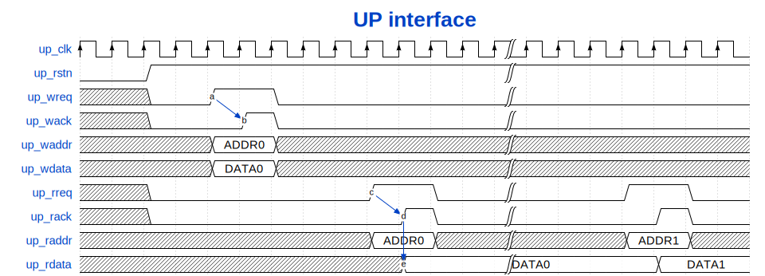

.. _interfaces:

Interfaces
================================================================================

.. _up_if:

Microprocessor Interface
--------------------------------------------------------------------------------

All the ADI IP cores contains multiple AXI register map modules, which control
a well specified part of the IP.
To avoid complicated interconnections inside the IP, using the
:git-hdl:`up_axi.v <library/common/up_axi.v>` module, the AXI Memory Mapped
interface is converted into a so called **Microprocessor interface** or
**uP interface**. This interface has an independent write and read channel,
and each channel contains an address bus, a data bus, a request (driven by manager)
and an acknowledge (driven by subordinate) control signals.
All the uP interface signals names have a ``up_`` prefix, this differentiate
themselves clearly from other internal signals.

uP Interface and Signals
--------------------------------------------------------------------------------

.. list-table:: Clock and reset

   * - Pin
     - Type
     - Description
   * - ``up_clk``
     - ``input``
     - Clock signal, should be connected to s_axi_aclk
   * - ``up_rstn``
     - ``input``
     - An active low reset, should be connected to s_axi_aresetn

.. list-table:: Read interface

   * - Pin
     - Type
     - Description
   * - ``up_rreq``
     - ``output``
     - Read request from the processor
   * - ``up_rack``
     - ``input``
     - Read acknowledge from the core
   * - ``up_raddr``
     - ``output[13:0]``
     - Read address defined by the processor
   * - ``up_rdata``
     - ``input[31:0]``
     - Read data, delivered by the core

.. list-table:: Write interface

   * - Pin
     - Type
     - Description
   * - ``up_wreq``
     - ``output``
     - Write request from the processor
   * - ``up_wack``
     - ``input``
     - Write acknowledge from the core
   * - ``up_waddr``
     - ``output[13:0]``
     - Write address defined by the processor
   * - ``up_wdata``
     - ``output[31:0]``
     - Write data defined by the processor

.. note::

   The directions of the signals are defined from the managers (microprocessor)
   perspective.

Timing diagram
--------------------------------------------------------------------------------

The following timing diagram illustrates the signals and functionality of the
interface. It show a register write access and two consecutive register read access.

.. wavedrom

   {signal: [
     {name: 'up_clk',   wave:'P............|.......'},
     {name: 'up_rstn',  wave:'0.1..........|.......'},
     {name: 'up_wreq',  wave:'x.0.1.0......|.......',
                        node:'....a................'},
     {name: 'up_wack',  wave:'x.0..10......|.......',
                        node:'.....b...............'},
     {name: 'up_waddr', wave:'x...2.x......|.......', data: ['ADDR0']},
     {name: 'up_wdata', wave:'x...2.x......|.......', data: ['DATA0']},

     {name: 'up_rreq',  wave:'x.0......1.0.|...1.0.',
                        node:'.........c...........'},
     {name: 'up_rack',  wave:'x.0.......10.|....10.',
                        node:'..........d..........'},
     {name: 'up_raddr', wave:'x........2.x.|...2.x.', data: ['ADDR0', 'ADDR1']},
     {name: 'up_rdata', wave:'x.........2..|....2..', data: ['DATA0', 'DATA1'],
                        node:'..........e..........'},

     ],
     edge: [
        'a->b', 'c->d', 'd->e'
     ],
    head: {text:
       ['tspan', {class:'info h3'}, 'UP interface']
    }
   }

   UP interface timing diagram

References
--------------------------------------------------------------------------------

AMBA AXI
~~~~~~~~~~~~~~~~~~~~~~~~~~~~~~~~~~~~~~~~~~~~~~~~~~~~~~~~~~~~~~~~~~~~~~~~~~~~~~~~

* AMBA `Specification <https://www.arm.com/architecture/system-architectures/amba/amba-specifications>`__
* Vivado Design Suite: `AXI Reference Guide <https://docs.amd.com/v/u/en-US/ug1037-vivado-axi-reference-guide>`__

Avalon
~~~~~~~~~~~~~~~~~~~~~~~~~~~~~~~~~~~~~~~~~~~~~~~~~~~~~~~~~~~~~~~~~~~~~~~~~~~~~~~~

* Avalon Interface `Specification <https://www.intel.com/content/www/us/en/docs/programmable/683091/22-3/introduction-to-the-interface-specifications.html>`__
