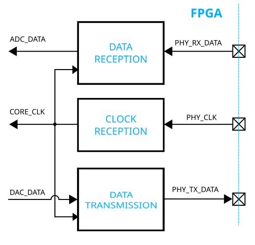

.. _source_sync_if:

Source Synchronous Interface
================================================================================

This page presents a possible design solution for a source synchronous
interface, which can be used to interface any converter that has a source
synchronous data interface. The main focus is on the generic interface
architecture; information regarding FPGA vendor specific hardware modules and
IPs can be found on the respective FPGA manufacturer site, some of which are
linked in the References section below.

What is a Source Synchronous Interface?
--------------------------------------------------------------------------------

A source synchronous interface is a common interface type for chip-to-chip
communication. The base idea behind the interface is to send a copy of the
clock along with the data, which simplifies the timing model of the
interface. This interface type is a successor of the system synchronous
interface, where both the source and destination IC receive the clock from a
common source (clock generator IC).

Architecture
--------------------------------------------------------------------------------

In general, a source synchronous interface consists of a clock reception
module, which contains all the necessary IO resource instances to receive the
digital interface clock from the device. Depending on the device type, it may
also contain a data reception and/or a data transmission module. The
interface exposed to the FPGA logic is a simplified FIFO interface, described
in more detail :dokuwiki:`here <resources/fpga/docs/adi_fifo_if>`.

The ``CORE_CLK`` can have the same frequency as the ``PHY_CLK``, or an
integer division of the ``PHY_CLK`` frequency. The general rule of thumb is
to keep the ``CORE_CLK`` frequency below 200 MHz, since it is used throughout
the data path and a too high ``CORE_CLK`` can significantly reduce the timing
margins, making it difficult (or impossible) to close timing.

If the frequency of the ``PHY_CLK`` is too high, SERDES macros are used to
convert the interface clock and data rate into a more manageable level.

Implementation with AMD Xilinx FPGAs
--------------------------------------------------------------------------------

Files
~~~~~~~~~~~~~~~~~~~~~~~~~~~~~~~~~~~~~~~~~~~~~~~~~~~~~~~~~~~~~~~~~~~~~~~~~~~~~~~~

.. list-table::
   :header-rows: 1

   * - Name
     - Description
   * - :git-hdl:`library/xilinx/common/ad_data_clk.v`
     - Clock reception module, contains an input clock buffer and a global
       clock buffer for distribution.
   * - :git-hdl:`library/xilinx/common/ad_data_in.v`
     - Data reception module, general architecture: ``ibuf -> idelay ->
       iddr``.
   * - :git-hdl:`library/xilinx/common/ad_data_out.v`
     - Data transmission module, general architecture: ``oddr -> odelay ->
       obuf``.
   * - :git-hdl:`library/xilinx/common/ad_serdes_clk.v`
     - Clock reception module for SERDES architecture, general architecture:
       ``ibuf -> mmcm``.
   * - :git-hdl:`library/xilinx/common/ad_serdes_in.v`
     - Data reception module, general architecture: ``ibuf -> idelay ->
       iserdes``.
   * - :git-hdl:`library/xilinx/common/ad_serdes_out.v`
     - Data transmission module, general architecture: ``oserdes -> obuf``.

References
~~~~~~~~~~~~~~~~~~~~~~~~~~~~~~~~~~~~~~~~~~~~~~~~~~~~~~~~~~~~~~~~~~~~~~~~~~~~~~~~

* :xilinx:`Virtex 6 Clock Resources <support/documentation/user_guides/ug362.pdf>`
* :xilinx:`Virtex 6 SelectIO Resources <support/documentation/user_guides/ug361.pdf>`
* :xilinx:`7 Series Clock Resources <support/documentation/user_guides/ug472_7Series_Clocking.pdf>`
* :xilinx:`7 Series SelectIO Resources <support/documentation/user_guides/ug471_7Series_SelectIO.pdf>`
* :xilinx:`Ultrascale Clock Resources <support/documentation/user_guides/ug572-ultrascale-clocking.pdf>`
* :xilinx:`Ultrascale SelectIO Resources <support/documentation/user_guides/ug571-ultrascale-selectio.pdf>`

Implementation with Intel/Altera FPGAs
--------------------------------------------------------------------------------

.. note::

   The Intel/Altera implementation of this interface is not documented yet.
