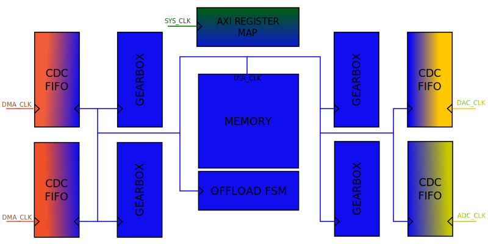

# Data offload IP core

## Description, general use cases

Data offload module for high-speed converters:

**NOTE**: This IP will always have a storage unit (internal or external to the FPGA) and is
designed to handle high data rates. If your data paths will run in a lower data
rate, and your intention is just to transfer the data to another clock domain or
to adjust the bus width of the data path, you may want to check out the util_axis_fifo or
util_axis_fifo_asym IPs.

The initialization and data transfer looks as follows:

  * in case of DAC, the DMA initialize the storage unit, after that the controller
will push the data to the DAC interface in one-shot or cyclic way

  * in case of ADC, the DMA request a transfer, the controller will save the data into
the storage unit, after that will push it to the DMA

  * BYPASS mode: simple streaming FIFO in case of clock rate or data width differences
between source and sink interfaces (data rate MUST match in order to work); the BYPASS
mode is used when an initially high rate path is downgraded to lower rates.

## Table of content

  * [Block diagrams](README.md#block-diagram)
  * [Parameters](README.md#parameters)
  * [Interfaces](README.md#interfaces)
  * [Register map](README.md#register-map)
  * [Clock tree](README.md#clock-tree)
  * [Data path](README.md#data-path)
  * [Control path](README.md#control-path-offload-fsm)

## Generic arhitecture

The main role of our data paths, is to stream data from point A to point B 
in a particular system. There are always a SOURCE and a DESTINATION
point, which can be a device (ADC or DAC), a DMA (for system memory) or any other
data processing IP.

In the context of Data Offload IP, we don't need to know who is the source and
who is the destination. Both interface is a AXI4 Stream interface, which can be 
supported in both Xilinx's an Intel's architecture, and can be connected to any device
core or DMA.

The storage unit is connected to the Data Offload controller via two FIFO interface.
This way the same controller can be used for various storage solutions. (BRAM, 
URAM, external memory etc.)

## Block diagram


## Parameters

|      NAME            |   TYPE      |  DEFAULT   |            DESCRIPTION      |
|----------------------|:-----------:|:----------:|:---------------------------:|
|ID                    |  integer    |    0       | Instance ID number | 
|MEM_TYPE              |  [ 0:0]     |    0       | Define the used storage type: FPGA RAM - 0; external DDR - 1 |
|MEM_SIZE_LOG2         |  integer    |   10       | Log2 value of storage size, defines the width of transfer length control signals. |
|TX_OR_RXN_PATH        |  [ 0:0]     |    1       | If set TX path enabled, otherwise RX |
|SRC_DATA_WIDTH        |  integer    |    64      | The data width of the source interface |
|DST_DATA_WIDTH        |  integer    |   124      | The data width of the destination interface |
|DST_CYCLIC_EN         |  [ 0:0]     |     0      | Enables CYCLIC mode for destinations like DAC | 
|AUTO_BRINGUP          |  [ 0:0]     |     1      | If enabled the IP runs automatically after bootup | 
|SYNC_EXT_ADD_INTERNAL_CDC |  [ 0:0] |     1      | If enabled the external sync pin is synchronized to the internal clock domain with a CDC. | 
|HAS_BYPASS            |  [ 0:0]     |     1      | If set to zero the bypass FIFO is not implemented. | 

## Interfaces

### AXI4 Lite Memory Mapped Slave (S_AXI4_LITE)

This interface is used to access the register map.

```verilog
// interface clock -- system clock -- 100 MHz
input                   s_axi_aclk
// interface resetn -- synchronous reset active low
input                   s_axi_aresetn

/* write address channel */

// validates the address on the bus
input                   s_axi_awvalid
// write address
input       [15:0]      s_axi_awaddr
// protection type -- not used in the core
input       [ 2:0]      s_axi_awprot
// write ready, indicates that the slave can accept the address
output                  s_axi_awready

/* write data channel */

// validate the data on the bus
input                   s_axi_wvalid
// write data
input       [31:0]      s_axi_wdata
// write strobe, indicates which byte lanes to update
input       [ 3:0]      s_axi_wstrb
// write ready, indicates that the slave can accept the data
output                  s_axi_wready

/* write response channel */

// validates the write response of the slave
output                  s_axi_bvalid
// write response, indicate the status of the transfer
output      [ 1:0]      s_axi_bresp
// response ready, indicates that the master can accept the data
input                   s_axi_bready

/* read address channel */

// validates the address on the bus
input                   s_axi_arvalid
// read address
input       [15:0]      s_axi_araddr
// protection type -- not used in the core
input       [ 2:0]      s_axi_arprot
// read ready, indicates that the slave can accept the address
output                  s_axi_arready

/* read data channel */

// validate the data on the bus
output                  s_axi_rvalid
// read response, indicate the status of the transfer
output      [ 1:0]      s_axi_rresp
// read data drivers by the slave
output      [31:0]      s_axi_rdata
// read ready, indicates that the master can accept the data
input                   s_axi_rready
```

### Supported data interfaces

**NOTE**: To simplify the design both the source and destination data interface is
an AXI4 streaming interface. A FIFO write (ADC) interface can be treated as AXI4
stream where only the master controls the data rate (s_axis_ready is always asserted), 
and a FIFO read (DAC) interface can be treated as an AXI4 stream where only the slave
controls the data rate. (m_axis_valid is always asserted).

#### AXI4 Stream interface (S_AXIS | M_AXIS)

* The AXI Stream Slave (S_AXIS) interface is used to receive AXI stream from
the transmit DMA or ADC device.

* The AXI Stream Master (M_AXIS) interface is used to transmit AXI stream
to receive DMA or DAC device

```verilog
// NOTE: this reference is a master interface

// interface clock -- can be device/core clock or DMA clock
input                        m_axis_aclk
// interface resetn -- synchronous reset with the system clock
input                        m_axis_resetn
// indicates that the slave can accept a transfer in the current cycle (in case of an ADC core, this will control the stream)
input                        m_axis_ready
// indicates that the master is driving a valid transfer
output                       m_axis_valid
// primary payload
output [DATA_WIDTH-1:0]      m_axis_data
// indicates the boundary of a packet
output                       m_axis_last
// byte qualifier, we need this so we can have different DMA and device data widths
output [(DATA_WIDTH/8)-1:0]  m_axis_tkeep
```

**NOTE**: A packet will always be a full buffer. All the data beats going to be
full beats (all the bytes of the bus are valid), except the last one. **axis_last**
and **axis_tkeep** will be used to indicate a partial last beat. This information
should be transferred from the source domain to the sink domain, so we can read
back the data from memory correctly.

#### AXIS source and destination interface to the storage unit

This is blocking (back-pressure) interface for the storage unit,
with similar behavior of main AXIS data interfaces.

###  Initialization request interface

Define a simple request interface to initialize the memory:

  * The request will comes from the system and will put the data offload FSM
into a standby/ready state.


#### Synchronization modes

  * **AUTOMATIC**
    * ADC: The IP will start to fill up the buffer with samples as soon as possible.
    * DAC: As the DMA will send a valid last, the FSM will start to send the
stored data to the device.

  * **HARDWARE**
    * ADC and DAC: An external signal will trigger the write or read into or from
the memory.
    * **NOTE**: In case of DAC, if the DMA does not sent all the data into the
buffer, before a hardware sync event, the unsent data will be ignored. It's the
user/software responsibility to sync up these events accordingly.

  * **SOFTWARE**
    * The software write a RW1C register which will trigger the reads or writes
into or from the memory.

## Register Map

|  WORD  |  BYTE    |   BITS   |    NAME               | TYPE  | CLOCK DOMAIN |       DESCRIPTION       |
|-------:|:--------:|:--------:|:---------------------:|:-----:|:------------:|:-----------------------:|
| 0x0000 |  0x0000  |          | `VERSION`             |  RO   |  SYS         |  Version number         |
|        |          | [31:16]  | `MAJOR`               |       |              |                         |
|        |          | [15: 8]  | `MINOR`               |       |              |                         |
|        |          | [ 7: 0]  | `PATCH`               |       |              |                         |
| 0x0001 |  0x0004  |          | `PERIPHERAL_ID`       |  RO   |  SYS         |  Value of the IP configuration parameter |
| 0x0002 |  0x0008  |          | `SCRATCH`             |  RW   |  SYS         |  Scratch register       |
| 0x0003 |  0x000C  |          | `IDENTIFICATION`      |  RO   |  SYS         |  Peripheral identification. Default value: 0x44414F46 - ('D','A','O','F') |
| 0x0004 |  0x0010  |          | `SYNTHESIS_CONFIG`    |  RO   |  SYS         |  Core configuration registers |
|        |          | [13: 8]  | `MEM_SIZE_LOG2`       |       |              |  Log2 of memory size in bytes |
|        |          | [ 2: 2]  | `HAS_BYPASS`          |       |              |  If not set the bypass logic is not implemented. |
|        |          | [ 1: 1]  | `TX_OR_RXN_PATH`      |       |              |  RX Path => 0, TX => 1  |
|        |          | [ 0: 0]  | `MEMORY_TYPE`         |       |              |  The used storage type (embedded => 0 or external => 1) |
| 0x0007 |  0x001C  |          | `TRANSFER_LENGTH`     |  RW   |  SRC         |  Transfer length        |
| 0x0020 |  0x0080  |          | `MEM_PHY_STATE`       |  RO   |  DDR         |  Status bits of the memory controller IP |
|        |          | [ 5: 5]  | `UNDERFLOW`           |  RW1C |              |  Indicates that storage could not handle data rate during play. Available when core is in TX mode.|
|        |          | [ 4: 4]  | `OVERFLOW`            |  RW1C |              |  Indicates that storage could not handle data rate during capture. Available when core is in RX mode. |
|        |          | [ 0: 0]  | `CALIB_COMPLETE`      |       |              |  Indicates that the memory initialization and calibration have completed successfully |
| 0x0021 |  0x0084  |          | `RESETN_OFFLOAD`      |  RW   |  DST/SRC     |  Reset all the internal address registers and state machines |
|        |          | [ 0: 0]  | `RESETN`              |       |              |                         |
| 0x0022 |  0x0088  |          | `CONTROL`             |  RW   |  DST         |  A global control register |
|        |          | [ 1: 1]  | `ONESHOT_EN`          |       |              |  By default the TX path runs on CYCLIC mode, set this bit to switch it to ONE-SHOT mode |
|        |          | [ 0: 0]  | `OFFLOAD_BYPASS`      |       |              |  Bypass the offload storage, the data path consist just of a CDC FIFO |
| 0x0040 |  0x0100  |          | `SYNC_TRIGGER`        |  RW1C |  SRC         |  Synchronization setup for RX and TX path |
|        |          | [ 0: 0]  | `SYNC_TRIGGER`        |       |              |  Trigger the data capture |
| 0x0041 |  0x0104  |          | `SYNC_CONFIG`         |  RW   |  SRC         |  Synchronization setup |
|        |          | [ 1: 0]  | `SYNC_CONFIG`         |       |              |  Auto - '0'; hardware - '1'; software - '2' |
| 0x0080 |  0x0200  |          | `FSM_DBG`             |  RO   |              |  Debug register for the offload FSM |
|        |          | [11: 8]  | `FSM_STATE_READ`      |       |  SRC         |  The current state of the read-offload state machine |
|        |          | [ 4: 0]  | `FSM_STATE_WRITE`     |       |  DST         |  The current state of the write-offload state machine |

## Clock tree

In general there are at least two different clock in the data offload module:

  * DMA or system clock : on this clock will run all the front end interfaces
  * Memory Controller user clock : user interface clock of the DDRx controller (**optional**)
  * Device clock : the digital interface clock of the converter



A general frequency relationship of the above clocks are:

```
  CLKdma <= CLKddr <= CLKconverter
```

The clock domain crossing should be handled by the [util_axis_fifo](https://github.com/analogdevicesinc/hdl/tree/main/library/util_axis_fifo) module.
  * **TODO** : Make sure that we support both AXIS and FIFO
  * **TODO** : Add support for asymmetric aspect ratio.

All the back end paths (device side) are time critical. The module must read or
write from or into the storage at the speed of the device.

```
  DDR data rate >= Device data rate
  DDR data rate >= ADC data rate + DAC data rate
```

## Data path


  * The data path should be designed to support any kind of difference between
the source, memory and sink data width.

  * The data width adjustments will be made by the CDC_FIFO.

  * In both path (ADC and DAC) the data stream at the front-end side is packatized,
meaning there is a valid TLAS/TKEEP in the stream. While in the back-end side
the stream is continuous. (no TLAST/TKEEP)
    * The DAC path have to have a depacketizer to get rid of the last partial beat
from the stream.
    * Because the ADC path already arrive in a packed form, and we always will
fill up the whole storage, we don't need to treat special use-cases.

### Used storage elements

|                       |         ZC706      |       ZCU102      |       A10SOC     |
|:----------------------|:------------------:|:-----------------:|:----------------:|
|          FPGA         | XC7Z045 FFG900 – 2 | XCZU9EG-2FFVB1156 | 10AS066N3F40E2SG |
| External Memory Type  |     DDR3 SODIMM    |        DDR4       |   DDR4 HILO      |
| External Memory Size  |         1 GB       |       512 MB      |      2 GB        |
| Embedded Memory Type  |         BRAM       |        BRAM       |      M20K        |
| Embedded Memory Size  |       19.1 Mb      |       32.1 Mb     |      41 Mb       |

### Data width manipulation

* data width differences should be treated by the CDC FIFO

* the smallest granularity should be 8 bits. This constraints mainly will generate
additional logic just in the TX path, taking the fact that the data from the ADC
will come packed.

* the gearbox main role is to improve the DDR's bandwidth, strips the padding bits
of each samples, so the raw data could be stored into the memory.

### Xilinx's MIG vs. Intel's EMIF

* Incrementing burst support for 1 to 256 beats, the length of the burst should
be defined by the internal controller

* Concurrent read/write access, the external memory to be shared between an ADC
and DAC
* Dynamic burst length tuning: an FSM reads and writes dummy data until both
ADC's overflow and DAC's underflow lines are de-asserted. Pre-requisites : both
device's interface should be up and running.

* **TODO**: prefetch the next transfer if it's possible, by driving the address channels ahead (e.g. Overlapping read burst in case of AXI4)

* Optional gearbox to congest the samples in order to increase the maximum data rate.
* In general we packing all samples into 16 bits. This can add a significant
overhand to the maximum real data rate on the memory interface. The gearbox main
role is to pack and unpack the device's samples into the required data width. (in general 512 or 1024 bit)

Boards with FPGA side DDR3/4 SODIMMs/HILO: ZC706, ZCU102, A10SOC

|                              |  ZC706    |  ZCU102    |   A10SOC   |
|------------------------------|:---------:|:----------:|:----------:|
| Max data throughputs (MT/s)  |   1600    |   2400     |    2133    |
| DDRx reference clocks        |  200 MHz  |  300 MHz   |    133 MHz |
| DDRx Data bus width          |    64     |   16       |     64     |
| Memory to FPGA clock ratio   |    4:1    |   4:1      |    4:1     |
| UI type & burst length       | AXI4-256  | AXI4-256   | Avalon Memory Map |
| UI data width                |    512    |   128      |    512     |

### Internal cyclic buffer support for the TX path


* On the front end side if the TX path, a special buffer will handle the data
width up/down conversions and run in cyclic mode if the length of the data set
is smaller than 4/8 AXI/Avalon burst. This way we can avoid to overload the memory
interface with small bursts.

* On the back end side, because the smallest granularity can be 8 bytes, we need
a dynamic 'depackatizer' or re-aligner, which will filter out the invalid data
bytes from the data stream. (this module will use the tlast and tkeep signal of
the AXI stream interface)

## Control path - Offload FSM

### RX control FSM for internal RAM mode


### TX control FSM for internal RAM mode


**TODO** FSMs for the external DDR mode

## References

### AMBA AXI
  * [AMBA specification](http://infocenter.arm.com/help/topic/com.arm.doc.set.amba/index.html#specs)
  * [UG761 AXI Reference Guide](https://www.xilinx.com/support/documentation/ip_documentation/ug761_axi_reference_guide.pdf)

### Avalon
  * [Avalon Interface Specification](https://www.altera.com/en_US/pdfs/literature/manual/mnl_avalon_spec.pdf)

### Xilinx
  * [Device Memory Interface Solutions](https://www.xilinx.com/support/documentation/ip_documentation/mig_7series/v4_2/ds176_7Series_MIS.pdf)
  * [Device Memory Interface Solutions User Guide](https://www.xilinx.com/support/documentation/ip_documentation/mig_7series/v4_2/ug586_7Series_MIS.pdf)
  * [Ultrascale Architecutre-Based FPGAs Memory IP (v1.4)](https://www.xilinx.com/support/documentation/ip_documentation/ultrascale_memory_ip/v1_4/pg150-ultrascale-memory-ip.pdf)
  * [Xilinx FIFO Generator](https://www.xilinx.com/products/intellectual-property/fifo_generator.html#documentation)
  * [7 Series FPGAs Memory Resources](https://www.xilinx.com/support/documentation/user_guides/ug473_7Series_Memory_Resources.pdf)
  * [Ultrascale Memory Resources](https://www.xilinx.com/support/documentation/user_guides/ug573-ultrascale-memory-resources.pdf)

### Intel
  * [Intel Arria 10 Core Fabric and General Purpose I/Os Handbook](https://www.altera.com/en_US/pdfs/literature/hb/arria-10/a10_handbook.pdf)
  * [Intel Arria 10 External Memory Interface IP User Guide](https://www.altera.com/en_US/pdfs/literature/ug/ug-20115.pdf)
  * [Intel Arria 10 External Memory Interface IP Design Example](https://www.altera.com/en_US/pdfs/literature/ug/ug-20118.pdf)
  * [Intel SCFIFO and DCFIFO](https://www.altera.com/content/dam/altera-www/global/en_US/pdfs/literature/ug/ug_fifo.pdf)
  * [Intel Startix 10 High-Performance Design Handbook](https://www.altera.com/content/dam/altera-www/global/en_US/pdfs/literature/hb/stratix-10/s10_hp_hb.pdf)
  * [Intel Stratix 10 Embedded Memory User Guide](https://www.altera.com/en_US/pdfs/literature/hb/stratix-10/ug-s10-memory.pdf)

### Supported FPGA boards
  * [ZC706](https://www.xilinx.com/products/boards-and-kits/ek-z7-zc706-g.html)
  * [ZCU102](https://www.xilinx.com/products/boards-and-kits/ek-u1-zcu102-g.html)
  * [A10SOC](https://www.altera.com/products/boards_and_kits/dev-kits/altera/arria-10-soc-development-kit.html)
