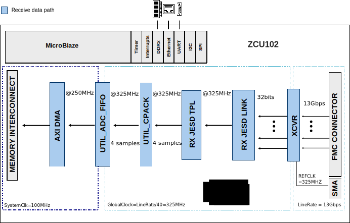
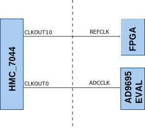

# AD9695-EVAL HDL reference design

## Overview

The following design supports Xilinx FPGA's. The AD9695 EVAL prototyping system connects to the FPGA carrier board through a FMC (FPGA Mezzanine Cad) high pin count connector.  

Currently supported carriers:

|  Carrier name | FMC connector |
| ------------- | ------------- |
|  ZCU102       |   HPC1        |

## Architecture

The main scope of the HDL design is to provide all the required digital interfaces
for the data acquisition board of the prototyping system.

The following block diagram presents the simplified system architecture: 

## Clocking

## References

+ AD9695 HDL wiki: https://wiki.analog.com/resources/eval/user-guides/ad9695_fmc

## Support

For technical support please visit [FPGA Referece Designs](https://ez.analog.com/fpga/) community in EngineerZone.
