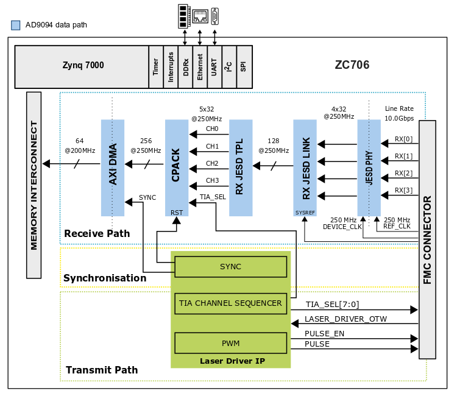

# AD_FMCLIDAR1_EBZ HDL reference design

## Overview

The following design supports both Xilinx and Intel FPGA's. The [AD_FMCLIDAR1_EBZ](https://www.analog.com/en/design-center/evaluation-hardware-and-software/evaluation-boards-kits/AD-FMCLIDAR1-EBZ.html)
prototyping system connects to the FPGA carrier board through a FMC (FPGA Mezzanine Cad)
high pin count connector.  

Detailed user guide of the prototyping platform can be found [here](https://wiki.analog.com/resources/eval/user-guides/ad-fmclidar1-ebz).

Currently supported carriers:

|  Carrier name | FMC connector |
| ------------- | ------------- |
|  ZC706        |   FMC_HPC     |
|  ZCU102       |   HPC0        |
|  Arria10SOC   |   FMCA_HPC    |

The design is easily portable to any Xilinx or Intel FPGA carrier board, which
has an FMC HPC connector, and have all the required connections. (See more info
in [system_constr.xdc](./zc706/system_constr.xdc) or [system_project.tcl](./a10soc/system_project.tcl))

You can find a porting guide in the [wiki.analog.com](https://wiki.analog.com/resources/fpga/docs/hdl/porting_project_quick_start_guide).

### Directory Structure

| Directory | Description |
| --------- | ----------- |
| common    | Common verilog and block design Tcl files |
| zc706     | ZC706 specific source files |
| zcu102    | ZCU102 specific source files |
| a10soc    | Arria10SOC specific source files |

More information about the directory structure of the HDL repository can be found [here](https://wiki.analog.com/resources/fpga/docs/git).

## Build instructions

The project is using GNU Make for build and bitstream generation. Change your directory
to your targeted carrier and run **make**.

More information about how to build HDL projects can be found [here](http://wiki.analog.com/resources/fpga/docs/build).

## Architecture

The main scope of the HDL design is to provide all the required digital interfaces
for the data acquisition board of the prototyping system.

The following block diagram presents the simplified system architecture: 

### AXI_LASER_DRIVER IP

The axi_laser_driver IP is responsible to generate a narrow pulse for the laser
driver circuit, to control the TIA channel selection on the analog front end (AFE)
board, and to synchronize the data acquisition to the generated pulses.

More information about the IP can be found [here](https://wiki.analog.com/resources/fpga/docs/axi_laser_driver).

### Control interfaces

| Name | Type | Details |
| ---- | ---- | ------- |
| adc_fd*                     | GPIO        | Monitors the AD9094 Fast detect output lines | 
| adc_pwdn                    | GPIO        | Controls the AD9094 Power-Down input line | 
| spi_adc_*                   | 4-wire SPI  | AD9094 configuration interface | 
| spi_vco_*                   | 3-wire SPI  | ADF436-7 configuration interface | 
| spi_clkgen_*                | 4-wire SPI  | AD9528 configuration interface | 
| laser_driver_p\n            | LVDS output | It controls the laser driver circuit, it is generated by the axi_laser_driver IP instance | 
| laser_gpio[13:0]            | GPIO        | Unused GPIO line on the lase board |
| tia_chsel[7:0]              | CMOS output | TIA channel selection lines, it is controlled by the axi_laser_driver instance |
| afe_dac_sda\scl\load\clr_n  | I2C/GPIO    | AD5627 configuration interface |
| rx_ref_clk_p\n              | LVDS        | JESD204B reference clock for the high-speed gigabit transceivers; runs at 250MHz |
| rx_device_clk_p\n           | LVDS        | JESD204B device clock for the transport layer and additional data processing; runs at 250MHz |
| rx_data_p\n[3:0]            | CML         | JESD204B high-speed serial lanes; runs at 10Gbps |
| rx_sync_p\n[1:0]            | LVDS        | JESD204B SYNC signals for interface synchronization |
| rx_sysref_p\n               | LVDS        | JESD204B SYSREF signal for deterministic latency |

### JESD204B interface

The JESD204B interface runs in Subclass 1 mode to ensure the deterministic latency 
of the link. The following tables are summarizing the JESD204B important configuration 
parameter and attributes.

| Parameter name | Abbreviation |Value |
| -------------- | ------------ | ---- |
| Number of lanes  | L | 4 | 
| Number of converter | M | 4 |
| Converter resolution | NP | 8 |
| Total number of Bits per Sample| NP | 8 |
| Samples per frame | S | 1 |
| Octets per frame | F | 1 |
| Frames per Multiframe | K | 32 |
| Number of control bits | CS | 0 |

| Rates and Clocks | Value | 
| ---------------- | ----- |
| Sample rate | 1GSPS |
| Lane rate | 10Gbps |
| GT reference clock | 250MHz |
| Device clock | 250 MHz | 

## References

+ AD-FMCLIDAR1-EBZ product page: https://www.analog.com/en/design-center/evaluation-hardware-and-software/evaluation-boards-kits/AD-FMCLIDAR1-EBZ.html
+ AD-FMCLIDAR1-EBZ user guide: https://wiki.analog.com/resources/eval/user-guides/ad-fmclidar1-ebz
+ ADI's FPGA Reference Designs HDL User Guide: https://wiki.analog.com/resources/fpga/docs/hdl
+ ADI's JESD204B Interface Framework: https://wiki.analog.com/resources/fpga/peripherals/jesd204
+ axi_laser_driver IP Core: https://wiki.analog.com/resources/fpga/docs/axi_laser_driver

## Support

For technical support please visit [FPGA Referece Designs](https://ez.analog.com/fpga/) community in EngineerZone.

